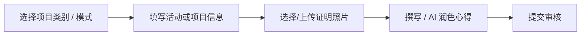

# 提交与修改活动日志

**活动日志**模块供 ARP 选手记录各项活动进度、上传证明文件、使用 AI 智能优化学习心得，并提交给评估员进行审核。

---

## 1. 提交新日志

进入系统后，在左侧导航菜单中点击 **Activity Log** 进入填写页面。

### 步骤一：选择项目类别
系统支持以下 4 大类别，选择不同类别时，表单会自动切换所需填写的项目：

1. **常规项目（志愿服务 Service / 技能学习 Skills / 体育技能 Physical）**：
   - **活动日期**：选择活动发生的单日日期。
   - **活动时长**：输入本次活动所花费的小时数。
   - **学习心得与成果**：记录活动内容与个人心得体会。

2. **野外探索 (Adventurous Journey)**：
   - **行前训练日期**：选择训练的开始与结束日期。
   - **旅程日期**：选择探索活动的开始与结束日期。
   - **活动地点与旅程目标**。
   - **每日活动总结**：按天填写行程记录。

3. **团体生活项目 (Residential Project)** *（仅限金奖选手）*：
   - **项目日期**：选择居住项目的开始与结束日期。
   - **活动地点与项目目标**。
   - **每日活动总结**：填写详细居住与服务记录。

4. **纯图片模式 (Image Only)**：
   - 适用于补充活动照片墙素材。
   - 仅需填写 **项目名称**、**图片说明** 并上传 1 张活动照片。

---

## 2. 证明文件与照片上传

每条日志均可关联证明照片或文档作为评估依据：

1. 点击 **添加证明文件** 按钮。
2. 从云端硬盘选择或上传所需的照片与证明文件。
3. 为文件设置说明描述（例如：*活动现场照片* 或 *获奖证书*）。
4. **图片预览**：将鼠标悬浮在文件链接上，即可实时弹出浮动小图预览。
5. **查看源文件**：点击 **查看** 按钮在新标签页中打开照片原图。
6. **重置图片**：点击清除按钮（`✕`）即可重新选择照片。

> **提示**：标注为照片类别的附件，将在生成 Word 报告时由系统自动排版至报告的照片墙区域。

---

## 3. AI 智能辅助优化心得

为帮助您撰写更规范、语言更通顺的总结，系统集成了 AI 智能润色功能：

1. 在 **学习心得** 输入框中写下您的原始草稿或笔记。
2. 点击 **AI 智能润色** 按钮。
3. 系统将分析您的记录，自动整理成条理清晰、表达得体的心得段落。
4. 如果希望恢复初始内容，随时点击 **还原** 按钮即可。

---

## 4. 编辑与修改日志

如需修改已提交的日志：

1. 点击页面右上角 **历史记录** 按钮打开日志列表。
2. 找到需要修改的记录，点击右侧 **编辑** 按钮。
3. 系统会将该日志的数据精准加载至表单中。
4. 修改相关内容或重选图片后，点击 **更新日志** 重新提交。

> **注意**：
> - 状态为 **待审核** 或 **已拒绝** 的日志均可重新编辑或删除。
> - 一旦日志状态变为 **已通过**，说明评估员已完成审核并锁定该记录，无法再编辑或删除。

