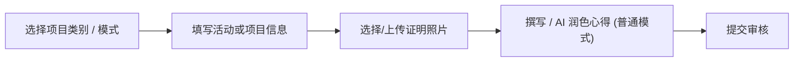

# 提交与修改活动日志

**活动日志**模块供 ARP 选手记录各项活动进度、上传证明文件、使用 AI 智能优化学习心得，并提交给评估员进行审核。

---

## 1. 提交新日志

进入系统后，在左侧导航菜单中点击 **Activity Log** 进入填写页面。

### 步骤一：选择项目类别
系统支持以下 5 大类别，选择不同类别时，表单会自动切换所需填写的项目：

1. **志愿服务 (Service) / 技能学习 (Skills) / 体育技能 (Physical)**：
   - **活动日期**：选择活动发生的单日日期。
   - **活动时长**：输入本次活动所花费的小时数。
   - **学习心得与成果**：记录活动内容与个人心得体会。

2. **野外探索 (Adventurous Journey)**：
   - **行前训练日期**：如包含行前训练，可选择训练的开始与结束日期。
   - **旅程日期**：选择探索活动的开始与结束日期。
   - **活动地点与旅程目标**。
   - **活动距离与活动时数**。
   - **每日活动总结**：按天填写第 1 天至第 4 天的具体路线与行程记录。

3. **团体生活项目 (Residential Project)** *（仅限金奖选手）*：
   - **项目日期**：选择居住项目的开始与结束日期。
   - **活动地点与项目目标**。
   - **每日活动总结**：按天填写第 1 天至第 5 天的详细居住与服务记录。

4. **仅上传图片 (Image Only 模式)**：
   - 适用于补充非常规证明图片或单独的活动照片墙素材。
   - 自动隐藏常规日期、小时数与长篇心得字段，仅需填写 **项目名称**、**图片说明** 并上传 1 张高清证明照片。

---

## 2. 证明文件与照片上传

每条日志均可关联证明照片或文档作为评估依据，上传的照片还会自动用于生成报告中的**活动照片墙**：

1. 点击 **添加证明文件**（仅上传图片模式下默认配置 1 组附件）。
2. 系统将弹出 **Google Drive 文件选择器** 或提供本地文件上传。
3. 从云端硬盘选择或上传所需的照片与证明文件。
4. 为文件设置说明描述（例如：*活动现场照片* 或 *获奖证书*）。
5. **缩略图浮动预览**：将鼠标悬浮在 **查看** 或文件名上，即可实时弹出浮动小图预览。
6. **直接查看云端源文件**：点击 **查看** 按钮，将在新标签页中直接打开 Google Drive 原图页面。
7. **重置图片**：在 `imgonly` 模式下点击清除按钮（`✕`），系统会将当前行恢复为 `未选择图片` 状态，方便重新选择文件而不破坏表格行结构。

> **提示**：标注为照片类别的附件，将在导出 Word 报告时由后端自动下载、添加黑框并排版至报告的照片墙区块。

---

## 3. AI 智能辅助优化心得

为帮助您撰写更规范、语言更通顺的总结，系统集成了 AI 智能润色功能：

1. 在**学习心得**输入框中写下您的原始草稿或随手笔记。
2. 点击 **AI 智能润色** 按钮。
3. 系统将分析您的记录，在保持原意的基础上重构成条理清晰、表达得体的心得段落。
4. 如果希望恢复初始内容，可随时点击 **还原** 按钮。

---

## 4. 编辑与修改日志

如需修改已提交的日志：

1. 点击页面右上角的 **历史记录** 按钮打开日志列表弹窗。
2. 系统分为 **ARP Log** 与 **Image Only** 两个独立标签页，找到目标记录后点击右侧的 **编辑** 按钮。
3. 系统会将该日志的数据精准加载至表单中（自动识别普通日志模式或 `imgonly` 模式）。
4. 修改相关内容或重选图片后，点击 **更新日志** 重新提交。

> **注意**：
> - 状态为 **待审核** 或 **已拒绝** 的日志均可重新编辑或删除（删除需通过 SweetAlert2 二次确认）。
> - 一旦日志状态变为 **已通过**，说明评估员已完成审核并锁定该记录，无法再进行编辑或删除。
