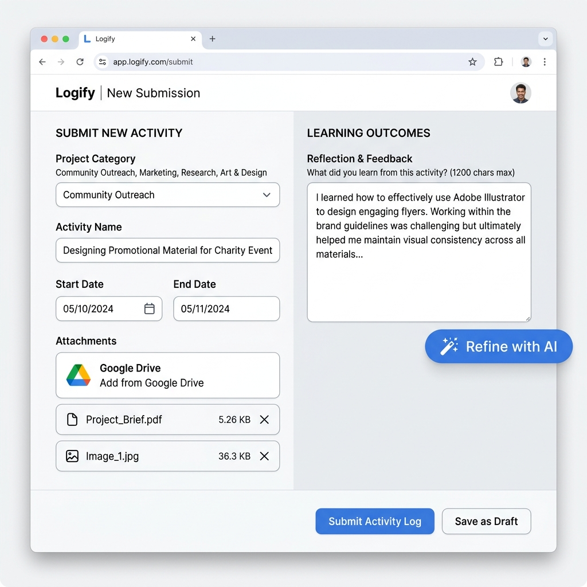

# Activity Log Management (新增 & 修改日志)



The **Activity Log** module allows participants to record their progress across various components, attach proof documents, refine learning outcomes using AI assistance, and submit entries for approval.


---

## 1. Creating a New Log (新增日志)

To create a new activity log entry:

1. Navigate to **Activity Log** in the sidebar.
2. Select a **Project Category (项目类别)**:
   - **Skills / Voluntary Service / Physical Recreation**: Requires a single date and activity hours.
   - **Adventurous Journey (AJ)**: Requires a date range, venue, activity goal, distance, and daily summaries.
   - **Residential Project (RP)** *(Gold level only)*: Requires a date range, venue, goal, and 5-day daily summaries.

```text
[ Select Component ] ──► [ Fill Dates & Hours ] ──► [ Add Proof Attachments ] ──► [ Write/Refine Outcome ] ──► [ Submit ]
```

---

## 2. Proof Attachments (证明文件)

You can attach multiple proof documents (photos, certificates, receipts) to support your log:

1. Click **添加证明文件** (+ Add Attachment).
2. Choose document type:
   - **Image**: Select an image file from Google Drive.
   - **Other**: Select PDFs or documents.
3. Enter a custom **Caption / Description** (e.g. *Activity Photo*).
4. Hover over the **查看 (View)** button to trigger a floating thumbnail preview popover!

---

## 3. Learning Outcome & AI Refinement (学习心得 & AI 辅助)

Your learning outcome reflects your personal growth and key takeaways from the activity.

### Using AI Refinement
If you need help polishing your reflection:

1. Type your raw reflection notes in the text area.
2. Click the **<i class="fas fa-magic"></i> Refine with AI** button.
3. The system will process your notes using the AI assistant, formatting them cleanly while retaining your original thoughts.
4. You can revert to your raw notes anytime by clicking **<i class="fas fa-undo"></i> Revert**.

---

## 4. Editing an Existing Log (修改日志)

- Click **历史记录 (History)** at the top right of the form.
- Locate the log entry you wish to update and click the **Edit (<i class="fas fa-edit"></i>)** action button.
- Modify the required fields and click **更新日志 (Update Log)**.

> **Note**: Logs that have already been marked as **Approved (已通过)** cannot be edited.
