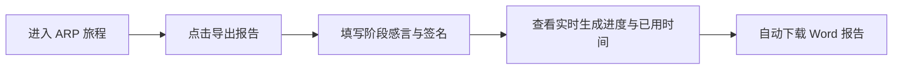
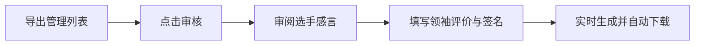

# 如何导出 ARP 报告

系统支持将选手已记录的活动日志（包括标准日志与图片日志）与个人资料自动汇总，导出为符合官方格式规范的 **Word 报告文件**（例如《Buku Rekod PerakGangsa》或《Buku Rekod Emas》）。

报告导出分为 **选手提交导出申请** 与 **管理员审核并正式导出** 两种途径与模式，均配备了**实时进度追踪与已用时间计时器**。

---

## 1. 实时生成进度条与计时弹窗

无论在预览导出还是正式导出模式下，点击导出后均会弹出**动态报告生成进度窗口**：

- **进度条与百分比**：实时显示 `5%` → `12%` → `25%` → `100%` 进度动效。
- **状态文本提示**：实时反馈当前后台操作（例如 `正在下载媒体图片文件 (3/12)...`、`正在处理活动照片墙...`）。
- **已用时间计时器**：在进度条下方实时显示处理已用时长（`已用时间: 00:14`）。
- **完成自动下载**：当报告生成完成（`100%`）时，弹窗将展现完成图标并自动触发 Word 文件下载，同时显示生成该报告的总耗时（`总耗时: 00:22`）。

---

## 方法 1：选手申请与预览导出

选手可通过个人中心填写总结感言与电子签名，并提交导出申请。

### 操作步骤：

1. 在导航菜单中进入 **ARP Journey** 或 **Activity Log** 页面。
2. 点击 **导出报告** 按钮，打开申请弹窗。
3. **填写个人感言**：
   - 分别针对志愿服务、技能学习以及体育技能等阶段填写阶段性总结与感言。
4. **绘制电子签名**：
   - 在签名板上绘制您的电子签名，或确认使用已保存的签名。
5. **提交申请与生成**：
   - 提交后系统弹出生成进度窗口，完成后自动下载预览版 Word 报告。

### 预览模式特点：

在管理员完成正式审核前，系统支持生成预览版本的报告文件：
- **包含日志范围**：包含所有**已通过**以及**待审核**的日志（含 `imgonly` 图片日志），方便选手预览整体排版与内容完整度。
- **文件标识**：导出的文件名末尾会带有预览标识。
- **签名与领袖评价**：领袖评价及领袖签名位置保持留空。

---

## 方法 2：管理员审核与正式导出

管理员可以在后台管理面板中审阅选手的导出申请、填写领袖评价及电子签署，并生成最终官方格式报告。

### 操作步骤：

1. 使用管理员账号登录，进入 **导出管理** 页面。
2. 在列表中查看所有已提交导出申请的选手及其完成进度。
3. 点击目标选手的 **审核** 按钮：

4. **查看选手感言与签名**：
   - 审阅选手提交的阶段总结感言及个人签名。
5. **填写领袖评价**：
   - 为各个项目阶段填写领袖评价与评语建议。
6. **签署领袖电子签名**：
   - 签署领袖电子签名，并确认领袖姓名。
7. **批准并生成正式报告**：
   - 点击 **批准并生成** 按钮，系统将实时生成最终 Word 报告文件，并在进度弹窗完成后自动开始下载。

---

## 报告导出模式对比

| 特性 / 模式 | 预览模式 | 正式导出模式 |
| :--- | :--- | :--- |
| **触发角色** | 选手自我预检 / 管理员预览 | 管理员审核批准后 |
| **包含日志状态** | 已通过 + 待审核 | 仅已通过 |
| **图片日志支持** | 自动下载排版 `imgonly` 图片块 | 自动下载排版 `imgonly` 图片块 |
| **选手签名与感言** | 包含阶段感言 | 包含阶段感言 + 电子签名 |
| **领袖评价与签名** | 留空 | 包含完整的领袖评价、姓名及签名 |
| **文件名称** | 带有预览后缀 | 官方标准文件名 |
