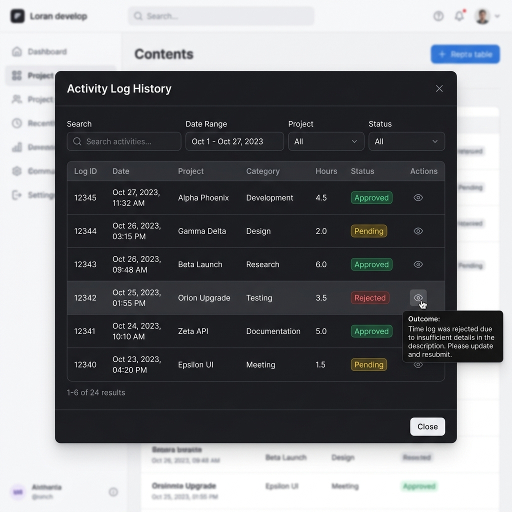

# Log History & Approval Statuses (历史记录与审核状态)

Participants can view their historical submissions, check real-time approval status, and preview learning outcomes via interactive tooltips.

---

## 1. Accessing Log History

Click the **<i class="fas fa-history"></i> 历史记录** button at the top right of the Activity Log submission form.

The modal displays a table containing:
- **Log ID** (Formatted unique reference code)
- **Date Range**
- **Component / Category**
- **Duration (Hours)**
- **Approval Status**
- **Action Buttons** (View / Edit)

---

## 2. Hover Tooltips

Hovering over any row in the **Log History Table** triggers an outcome preview tooltip:
- For standard entries: Displays your **Learning Outcome** text.
- For multi-day expeditions: Displays the formatted **Daily Activity Summaries** (Day 1, Day 2, etc.).

---

## 3. Status Badges

| Badge | Status | Description |
| :--- | :--- | :--- |
| 已通过 | **Approved** | Log has been reviewed and verified by an assessor. Cannot be edited further. |
| 待审核 | **Pending** | Log submitted and awaiting assessor review. |
| 已拒绝 | **Rejected** | Log rejected by assessor. Click **Edit** to address feedback and resubmit. |
| Archived | **Archived** | Log archived for administrative record keeping. |
