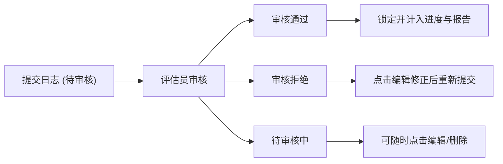

# 日志历史记录与审核状态

**历史记录**功能帮助选手与评估员实时追踪已提交日志的处理进度、查看各项目的累计时数、快速预览心得内容以及掌握审核状态。

---

## 1. 打开与查看历史记录

在日志提交页面的右上角，点击 **历史记录** 按钮即可打开历史记录弹窗。

弹窗内包含 **ARP Log** 与 **Image Only** 两个独立导航标签页 (Nav Tabs)：

### 1.1 ARP Log 标签页
展示所有的标准活动日志（服务、技能、体育技能、野外探索与团体生活）：
- **编号**：日志的系统记录 ID。
- **日期**：活动的开展日期或日期范围。
- **项目类别**：活动对应的所属类别。
- **时长**：记录的活动累计小时数。
- **附件数**：关联的证明文件数量。
- **审核状态**：当前日志的审批进度（Approved / Pending / Rejected）。
- **操作**：包含 **查看**、**编辑** 与 **删除** 按钮。

### 1.2 Image Only (仅上传图片) 标签页
专门归类展示补充图片日志：
- **序号 (No)**：清晰的递增序号 (1, 2, 3...)。
- **项目**：照片所归属的项目或活动名称。
- **图片说明**：上传证明图片的描述文字。
- **操作**：包含 **查看** (查看云端原图/鼠标悬浮缩略图)、**编辑** (回显至表单进行修改) 与 **删除** 按钮。

---

## 2. 悬浮预览与安全删除

1. **悬浮预览缩略图**：
   - 将鼠标悬浮在列表的操作按钮或文件名上，系统会自动弹出浮动小图预览。
2. **安全删除确认 (SweetAlert2)**：
   - 点击 **删除** 按钮时，系统会弹出 SweetAlert2 对话框 (`确定要删除此证明文件吗？`) 进行二次安全确认，防止误操作。

---

## 3. 审核状态说明

系统中的日志共有 4 种审核状态：

| 状态标识 | 状态名称 | 含义与操作权限 |
| :--- | :--- | :--- |
| Approved | **已通过** | 评估员已审核并通过该日志。已通过的记录将被锁定，无法再编辑或删除，其活动时数将计入总进度，并可导出至报告中。 |
| Pending | **待审核** | 日志已提交，正在等待评估员审核。在审核完成前，您仍可随时编辑修改或删除内容。 |
| Rejected | **已拒绝** | 评估员拒绝了该日志。您可以点击编辑按钮查看反馈，修正内容或补充材料后重新提交。 |
| Archived | **已归档** | 日志已被管理员归档保存，不再进入日常审核流程。 |

---

## 4. 修改与重新提交流程

