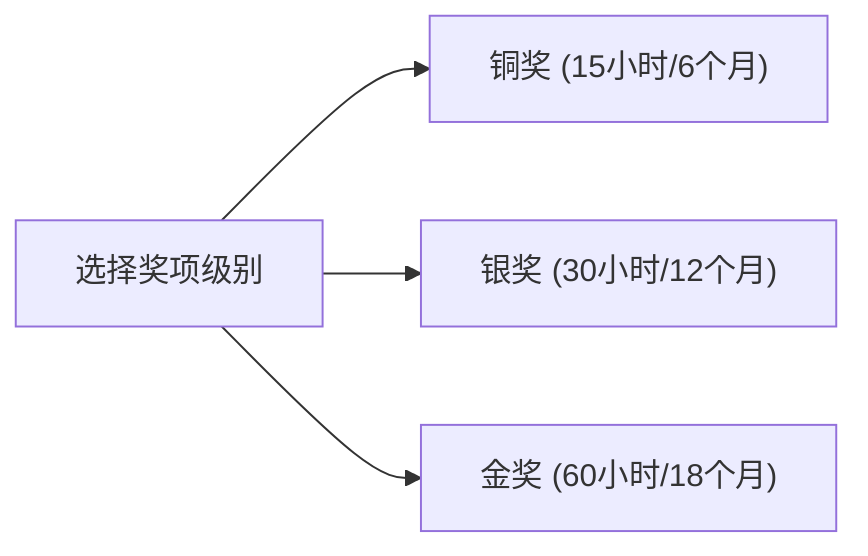

# 旅程设置与个人资料

在开始提交活动日志前，ARP 选手需要先完成 **ARP Journey（我的旅程）** 的初始设置。本模块用于配置您的奖项级别、项目目标主题以及个人基本资料。

---

## 1. 选择奖项级别

系统支持 3 个奖项级别的设置：

- **铜奖 (Bronze)**：适合初学者，三大基础项目要求各累计至少 15 小时，最少活动期限为 6 个月。
- **银奖 (Silver)**：三大基础项目要求各累计至少 30 小时，最少活动期限为 12 个月。
- **金奖 (Gold)**：最高级别，三大基础项目要求各累计至少 60 小时，最少活动期限为 18 个月，并额外包含团体生活项目。

---

## 2. 设置项目目标与主题

为了让评估员了解您的活动规划，您需要为各个项目指定具体主题：

1. **志愿服务**：设置您拟参与的服务项目与社会贡献主题。
2. **技能学习**：填写您计划学习或提升的技能（例如：摄影、乐器、编程等）。
3. **体育技能**：填写您参加的体育运动项目。
4. **野外探索**：设定探索旅程的主题与挑战目标。
5. **团体生活项目** *（仅限金奖）*：填写居住生活项目的服务主题。

---

## 3. 完善个人资料与照片

报告封面及官方档案需要完整的个人信息，请在页面中补充：

- **基本信息**：英文全名、身份证号码、出生日期、ARP 官方开始日期。
- **联系方式**：个人联系电话、家庭联系电话、接收报告通知的电子邮箱。
- **父母/监护人信息**：父母姓名与职业。
- **个人证件照**：点击通过 Google Drive 上传个人护照标准照片，该照片会自动生成在官方 Word 报告的封面上。

---

## 4. 进度仪表板与完成条件

完成初始设置后，系统首页将展示您的**进度仪表板**：

- **项目完成度百分比**：实时计算服务、技能、体育三大项目的已通过小时数与目标小时数的比例。
- **阶段状态提示**：清晰标记野外探索与团体生活项目的完成进度。
- **最少期限倒计时**：帮助您掌握活动开展的合规时间周期。
