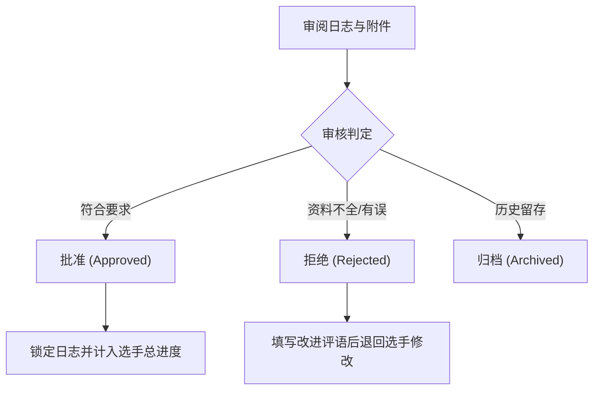

# 日志审核与评估指南

本指南专为评估员 (Assessor) 与领袖/管理员设计，介绍如何在系统后台审阅选手提交的活动日志、核查证明材料并做出审核判定。

---

## 1. 进入审核管理界面

拥有评估员或管理员权限的账号登录后，可从后台导航栏进入 **日志审核管理** 页面。

界面提供多种筛选工具：
- **按项目类别筛选**：快速过滤志愿服务、技能学习、体育技能、野外探索或团体生活项目。
- **按审核状态筛选**：查看所有待审核、已通过、已拒绝或已归档的记录。
- **选手姓名检索**：搜索特定选手的提交记录。

---

## 2. 审阅日志内容与证明材料

点击任意待审核日志的 **查看 / 审核** 按钮，弹出详细审阅窗口：

1. **核对基础数据**：检查活动日期、累计小时数是否符合真实开展情况。
2. **审阅学习心得**：阅读选手撰写的心得成果或 AI 润色后的总结。
3. **查验每日行程**：对于野外探索 (AJ) 或团体生活 (RP) 项目，仔细核查选手按天记录的行程总结。
4. **预览证明文件**：直接在窗口中点击预览选手从 Google Drive 关联的现场照片或证书文档。

---

## 3. 做出审核判定

评估员可在审阅窗口底部选择以下操作：

### 操作说明：

- **通过 (Approved)**：日志符合评估标准。通过后，该记录的时数将正式计入选手的奖项总进度中，且日志将被锁定防篡改。
- **拒绝 (Rejected)**：若活动说明不合规或缺少证明材料，评估员必须在弹窗中**填写具体反馈评语**（说明拒绝原因与改进要求），然后点击拒绝退回给选手修改。
- **归档 (Archived)**：将无效或重复提交的日志划入归档，保留记录但不参与进度计算。
