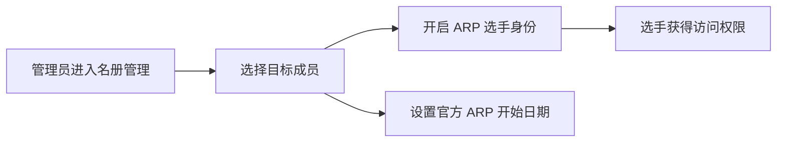

# 选手资格与名册管理

本指南面向系统最高管理员 (Admin)，介绍如何开通成员的 ARP 选手资格、管理全局选手名册以及设置初始活动日期。

---

## 1. 选手资格开通与关闭

只有获得开通资格的成员才能在个人中心看到 ARP 模块并提交活动日志：

1. 管理员登录后进入 **ARP 选手管理** 页面。
2. 列表中列出系统中的所有注册成员。
3. 找到目标成员，切换 **ARP 选手资格** 开关：
   - **开启**：赋予该成员 ARP 选手身份，允许其访问旅程设置与日志提交页面。
   - **关闭**：取消选手身份，隐藏个人中心的相关入口。

---

## 2. 设置官方开始日期

每位选手开展 ARP 项目都需要有官方认定的起始日期：

1. 在选手名册列表中，点击目标选手的 **编辑开始日期** 按钮。
2. 在弹出的日期选择器中设置该选手官方注册或开始活动的时间。
3. 保存后，该日期将作为考核选手最小活动期限（如铜奖 6 个月）的起始参考基准。

---

## 3. 全局进度追踪与监控

管理员可在选手名册页面集中查看全机构选手的整体开展动态：

- **奖项级别概览**：查看各选手选择的是铜奖、银奖还是金奖。
- **总完成进度条**：直观展示选手当前四大项目的综合完成百分比。
- **导出申请状态**：查看选手是否有正在处理或已批准的报告导出申请。
