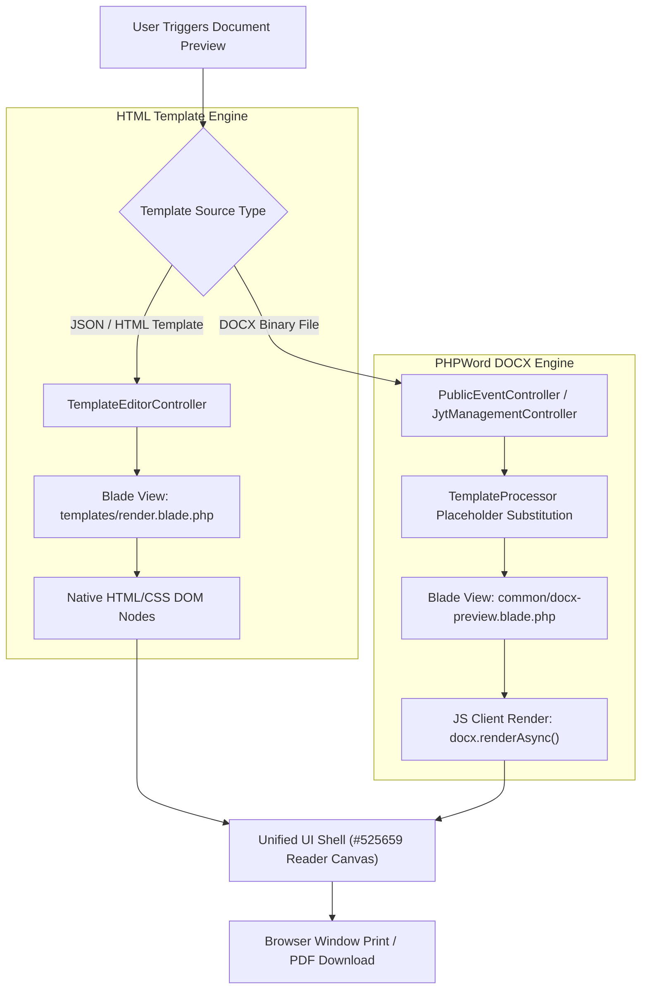

# HTML Template Renderer vs. DOCX Preview Engine

The application provides two distinct document preview mechanisms to handle different template sources, while maintaining an identical user interface shell so that end-users enjoy a consistent preview and print experience.

---

## 1. Document Rendering Dual-Engine Architecture

---

## 2. Technical Feature Comparison Matrix

| Feature | **HTML Template Renderer** | **DOCX Document Previewer** |
| :--- | :--- | :--- |
| **Blade View** | `resources/views/templates/render.blade.php` | `resources/views/common/docx-preview.blade.php` |
| **Source Document** | Native JSON/HTML template definition created in the visual Template Designer (`TemplateEditorController`). | Binary Microsoft Word (`.docx`) template file processed by PHP `PhpOffice\PhpWord\TemplateProcessor`. |
| **Rendering Process** | Server-side Laravel Blade converts JSON layout nodes into native web HTML elements (`
`, ``, `
`) and injects dynamic data array variables (e.g. `${user.name}`, `${appointment.start_date_en}`). | PHP backend replaces placeholders inside `word/document.xml` and serves the compiled `.docx` file. Client-side JavaScript (`docx-preview` / `docx.renderAsync`) parses Word XML schemas and converts them to canvas DOM elements. |
| **Font Fallbacks** | Standard web CSS font rules. | `ignoreFonts: true` in `docx.renderAsync()` with CSS font fallbacks (`"KaiTi", "楷体", "STKaiti", "Noto Serif SC", "SimSun", serif`) to prevent missing embedded font buffers from causing invisible text in Chromium browsers. |
| **Primary Use Cases** | Digital certificates and achievement awards (e.g. `JytManagementController::viewCertificate`). | Official appointment letters and registration acknowledgment letters (e.g. `JytManagementController::previewLetterPdf`, `PublicEventController::previewAcknowledgeLetter`). |
| **Printing** | Direct browser window printing (`window.print()`) of rendered HTML DOM nodes. | Direct browser window printing (`window.print()`) of canvas-rendered Word document pages. |

---

## 3. Standardized Visual UI Shell (`#525659` Theme)

To ensure visual consistency across both rendering engines, both Blade views utilize a unified styling specification:

- **Stage Background**: Dark slate gray (`#525659`).
- **Sticky Top Bar**: Dark header (`#323639`) featuring template title, recipient subtitle, **下载 PDF (Print)** button (`window.print()`), and **关闭** button.
- **Canvas Stage**: Centered A4 paper container with subtle drop-shadows mimicking a desktop PDF reader.

- **Print Stylesheet**: `@media print` rules automatically hide the sticky top action bar, remove body background colors, and center the document pages on print preview.

---

## 4. Related Documentation & Guides

- **[PHPWord Document Templates Overview](../working-with-phpword/01-overview.md)** — PHPWord backend processing pipeline and module mapping.
- **[Template Designer Overview](../template-designer/01-overview.md)** — Visual HTML template editor and schema architecture.

