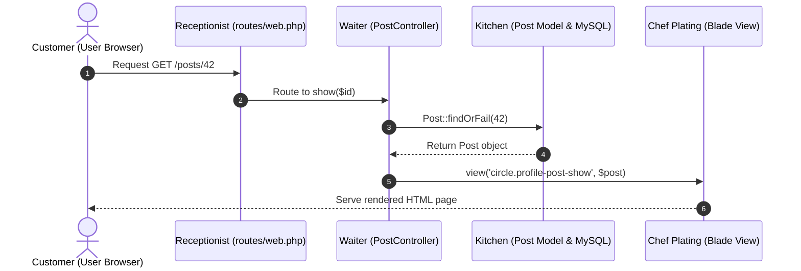

# 01 - MVC Architecture (Model - View - Controller)

## 🍽️ The Restaurant Analogy

Imagine a high-end restaurant:
1. **The Customer (User Browser)**: Enters the restaurant and asks for a dish (Types a URL like `/posts/42`).
2. **The Receptionist / Host (Routes - `routes/web.php`)**: Greets the customer, checks the request, and points them to the right waiter.
3. **The Waiter (Controller - `app/Http/Controllers/PostController.php`)**: Takes the order, asks the kitchen for ingredients, prepares the presentation, and serves the customer.
4. **The Kitchen / Pantry Keeper (Model - `app/Models/Post.php`)**: Fetches raw data from the storage room (MySQL Database) and validates ingredients.
5. **The Chef's Plating (View - `resources/views/circle/profile-post-show.blade.php`)**: Takes the raw ingredients (data) and formats them into a beautiful, ready-to-eat dish (HTML page).



---

## 🛠️ MVC in Action (`pgy_project`)

Let's look at how a post page load happens in our actual app:

### 1. Route Definition ([`routes/web.php`](file:///c:/Users/User/Desktop/My%20Coding%20Projects/pgy_project/routes/web.php))
```php
Route::get('/posts/{post}', [PostController::class, 'show'])->name('posts.show');
```

### 2. Controller Handler ([`PostController.php`](file:///c:/Users/User/Desktop/My%20Coding%20Projects/pgy_project/app/Http/Controllers/PostController.php#L18-L44))
```php
public function show(Post $post)
{
    // Check permission / business logic...
    $event = $post->event; // Model relation access

    // Return the view with data
    return view('circle.profile-post-show', compact('post', 'event'));
}
```

### 3. Eloquent Model ([`Post.php`](file:///c:/Users/User/Desktop/My%20Coding%20Projects/pgy_project/app/Models/Post.php))
Represents the `posts` table in database. Handles casting, attributes, and relationships.

### 4. Blade View (`resources/views/circle/profile-post-show.blade.php`)
Renders dynamic HTML using variables `$post` and `$event` provided by the controller.

---

## 💡 Junior Dev Takeaway
- **Never put database queries directly inside Blade views.**
- **Never put HTML directly inside Controllers.**
- Keep responsibilities separated so our code stays clean and maintainable!
