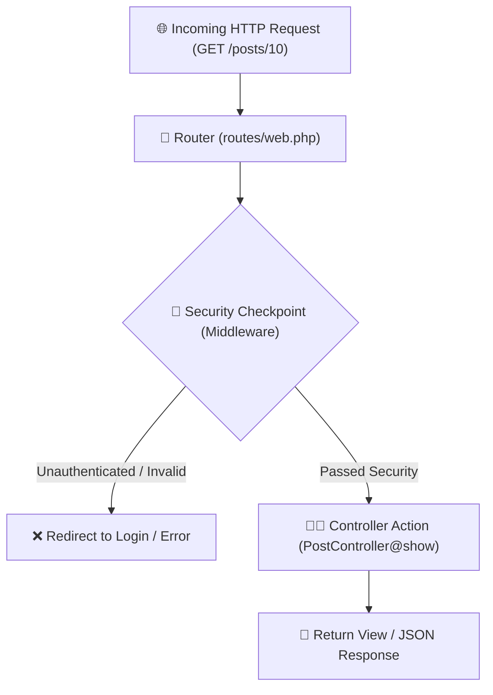

# 02 - Routing & Controllers

## 🚦 The Traffic Controller & Airport Security Analogy

### Routing & Request Flow


### Routing (Traffic Signposts)
Think of routes as street signposts or airport signboards. When an incoming traveler (HTTP Request) arrives at `GET /posts/10`, the router reads the destination sign and guides the request to the correct terminal (Controller Action).

### Middleware (Security Checkpoints)
Before reaching the gate (Controller method), travelers pass through security checkpoints (Middleware).
- Are you logged in? (Authentication Middleware)
- Do you have permission? (Role Check)
- Is your request valid? (CSRF Protection)

---

## 💻 Code Deep Dive (`pgy_project`)

### 1. Route Parameters & Route Model Binding
In [`routes/web.php`](file:///c:/Users/User/Desktop/My%20Coding%20Projects/pgy_project/routes/web.php):
```php
Route::get('/posts/{post}', [PostController::class, 'show']);
```

Notice `{post}` in the route URL string matching `Post $post` in [`PostController::show()`](file:///c:/Users/User/Desktop/My%20Coding%20Projects/pgy_project/app/Http/Controllers/PostController.php#L18):
```php
public function show(Post $post) 
{
    // Laravel automatically executes: Post::findOrFail($id) behind the scenes!
}
```
> ⚡ **Magic Alert (Route Model Binding)**: You don't need to manually type `Post::find($id)`! If you typehint `Post $post`, Laravel automatically fetches the matching record or returns a 404 error if it doesn't exist.

### 2. Request Validation (Sanitizing Input)
When accepting user input (e.g. creating a new post in [`PostController::store()`](file:///c:/Users/User/Desktop/My%20Coding%20Projects/pgy_project/app/Http/Controllers/PostController.php#L46-L55)):

```php
$request->validate([
    'type' => 'required|in:event_post,event_poll',
    'content' => 'required|string',
    'poll_options' => 'required_if:type,event_poll|array',
]);
```
- **Why?** Never trust client input! Validation ensures bad data is caught at the front door before reaching the database.

---

## 🎯 Best Practices for Controllers
1. **HTTP Verbs Matter**:
   - `GET`: Read data (e.g. view page, fetch post)
   - `POST`: Create new data (e.g. submit new post)
   - `PUT`/`PATCH`: Update existing data
   - `DELETE`: Remove data
2. **Return Types**: Controllers usually return a `view()`, a `redirect()`, or JSON (`response()->json(...)`).
