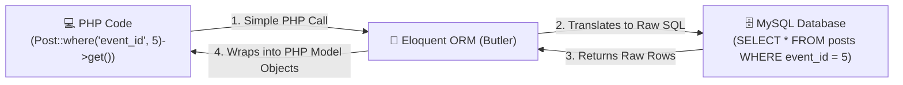

# 03 - Eloquent Models & Database Operations

## 🤖 The Personal Butler Analogy

Imagine your database is a massive library filled with thousands of raw SQL ledgers.
Without Eloquent, you would have to write complex SQL commands manually: `SELECT * FROM posts WHERE event_id = 5 AND expires_at > NOW()`.

**Eloquent ORM (Object-Relational Mapping)** is like your personal, fluent multi-lingual butler. You simply tell the butler: *"Butler, get me all active posts for Event #5."*



In PHP code:
```php
$posts = Post::where('event_id', 5)->where('expires_at', '>', now())->get();
```
Your butler translates this into optimal SQL, executes it, and presents the results as clean PHP objects!

---

## 🔍 Key Model Concepts in `pgy_project`

Let's dissect [`App\Models\Post`](file:///c:/Users/User/Desktop/My%20Coding%20Projects/pgy_project/app/Models/Post.php):

### 1. Attribute Casting (`$casts`)
Databases store data as raw strings or integers. Attribute casting converts them into rich PHP types automatically when loaded.

From [`Post.php`](file:///c:/Users/User/Desktop/My%20Coding%20Projects/pgy_project/app/Models/Post.php#L11-L16):
```php
protected $casts = [
    'is_pinned'  => 'boolean',   // Converts 1/0 from MySQL into true/false in PHP
    'expires_at' => 'datetime',  // Converts string timestamp into a Carbon date object
    'materials'  => 'array',     // Automatically decodes JSON string into PHP array
];
```

### 2. Model Lifecycle Events (`booted()`)
Models can react to actions (saving, created, deleted) automatically.

From [`Post.php`](file:///c:/Users/User/Desktop/My%20Coding%20Projects/pgy_project/app/Models/Post.php#L18-L26):
```php
protected static function booted()
{
    static::saving(function ($post) {
        if ($post->isDirty('content')) {
            // Automatically extract #hashtags from post content whenever saved!
            preg_match_all('/(?:^|\s)#([\p{L}\p{N}_]+)/u', $post->content ?? '', $matches);
            $post->hashtags = array_values(array_unique($matches[1] ?? []));
        }
    });
}
```

### 3. Accessors / Computed Attributes
Want to compute dynamic properties on the fly without storing extra columns in MySQL?

From [`Post.php`](file:///c:/Users/User/Desktop/My%20Coding%20Projects/pgy_project/app/Models/Post.php#L28-L39):
```php
public function getMaterialsLinksAttribute()
{
    // Access using $post->materials_links in Blade or Controller!
    ...
}
```

---

## ⚡ Essential Eloquent Cheat Sheet

| Task | Raw SQL Equivalent (Mental Model) | Eloquent Method |
| :--- | :--- | :--- |
| Find record by ID | `SELECT * FROM posts WHERE id = 1` | `Post::find(1)` or `Post::findOrFail(1)` |
| Filter by column | `SELECT * FROM posts WHERE type = 'event_post'` | `Post::where('type', 'event_post')->get()` |
| Create new row | `INSERT INTO posts (...) VALUES (...)` | `Post::create(['content' => 'Hello']);` |
| Update row | `UPDATE posts SET is_pinned = 1 WHERE id = 1` | `$post->update(['is_pinned' => true]);` |
| Delete row | `DELETE FROM posts WHERE id = 1` | `$post->delete();` |
