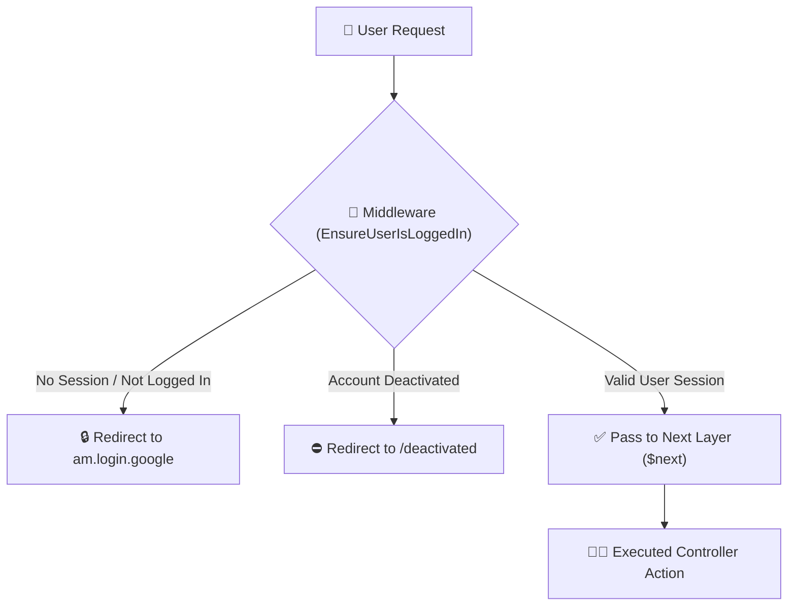

# 05 - Middleware & Authentication Security

## 🚪 The Nightclub Bouncer Analogy

Imagine a popular nightclub:
1. **The Entrance (Route)**: Anyone can walk up to the door (`/am/login`).
2. **The Bouncer (Middleware - `EnsureUserIsLoggedIn`)**: Stands at the door checking IDs.
   - *No ID / Not logged in?* Bouncer points you back to the ticket counter (`redirect()->route('am.login.google')`).
   - *Banned / Deactivated account?* Bouncer turns you away (`redirect()->route('deactivated')`).
   - *Valid ID?* Bouncer lets you pass through to the main hall (`$next($request)`).



---

## 💻 Code Deep Dive (`pgy_project`)

### Custom Middleware ([`EnsureUserIsLoggedIn.php`](file:///c:/Users/User/Desktop/My%20Coding%20Projects/pgy_project/app/Http/Middleware/EnsureUserIsLoggedIn.php))

```php
namespace App\Http\Middleware;

use Closure;
use Illuminate\Http\Request;
use Symfony\Component\HttpFoundation\Response;

class EnsureUserIsLoggedIn
{
    public function handle(Request $request, Closure $next): Response
    {
        // 1. Auth Check: Is user logged in?
        if (!$request->session()->has('userId') && !$request->session()->has('firebaseUid')) {
            if ($request->expectsJson()) {
                return response()->json(['message' => 'Unauthenticated.'], 401);
            }
            return redirect()->route('am.login.google');
        }

        // 2. Account Status Check
        $userId = $request->session()->get('userId');
        $user = \App\Models\User::find($userId);
        if ($user && !$user->is_active) {
            $request->session()->flush();
            return redirect()->route('deactivated');
        }

        // Pass request to the next layer (Controller)
        return $next($request);
    }
}
```

### Applying Middleware in [`routes/web.php`](file:///c:/Users/User/Desktop/My%20Coding%20Projects/pgy_project/routes/web.php)

You can attach middleware to single routes or route groups:

```php
Route::middleware([EnsureUserIsLoggedIn::class])->group(function () {
    Route::get('/dashboard', [AchievementDashboardController::class, 'index']);
    Route::get('/profile', [UpdatePersonalInfoController::class, 'index']);
});
```

---

## 💡 Junior Dev Takeaway
- **Never manually duplicate authentication check `if (!session('userId'))` in every single controller method!**
- Use **Middleware** to guard routes globally, keeping controller methods clean and focused on business logic.
