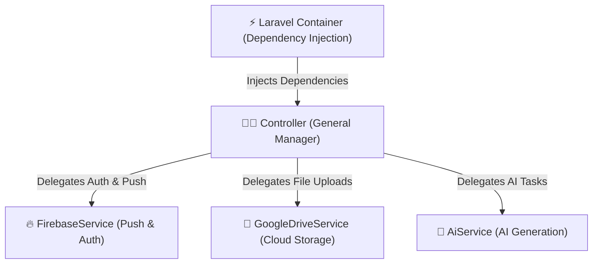

# 06 - Services & Dependency Injection

## 🧰 The Specialist Contractor Analogy

Imagine building a house:
- The **General Manager (Controller)** coordinates the project.
- But when it's time to install complex plumbing, solar panels, or cloud storage integrations, the manager doesn't do it personally. They hire a **Specialist Contractor (Service Class)**.



In `pgy_project`, controllers delegate heavy integrations (Firebase, Google Drive, AI, Email) to specialized **Service classes** located in [`app/Services`](file:///c:/Users/User/Desktop/My%20Coding%20Projects/pgy_project/app/Services).

---

## 💻 Code Deep Dive (`pgy_project`)

### 1. Service Classes ([`app/Services`](file:///c:/Users/User/Desktop/My%20Coding%20Projects/pgy_project/app/Services))
We have dedicated service classes for external APIs and heavy logic:
- [`FirebaseService.php`](file:///c:/Users/User/Desktop/My%20Coding%20Projects/pgy_project/app/Services/FirebaseService.php): Handles Firebase Auth & Push Notifications.
- [`GoogleDriveService.php`](file:///c:/Users/User/Desktop/My%20Coding%20Projects/pgy_project/app/Services/GoogleDriveService.php): Manages document uploads & links.
- [`EmailService.php`](file:///c:/Users/User/Desktop/My%20Coding%20Projects/pgy_project/app/Services/EmailService.php): Handles sending emails.

### 2. Dependency Injection (Constructor Injection)
Instead of instantiating services manually (`$firebase = new FirebaseService()`), Laravel's Service Container injects them automatically!

Look at [`PostController.php`](file:///c:/Users/User/Desktop/My%20Coding%20Projects/pgy_project/app/Http/Controllers/PostController.php#L9-L16):

```php
namespace App\Http\Controllers;

use App\Services\FirebaseService;

class PostController extends Controller
{
    protected $firebase;

    // Laravel automatically builds and passes FirebaseService here!
    public function __construct(FirebaseService $firebase)
    {
        $this->firebase = $firebase;
    }

    public function store()
    {
        // Simply call service methods directly
        $this->firebase->sendNotification(...);
    }
}
```

---

## 💡 Junior Dev Takeaway
- **When should you create a Service class?**
  - When code is reused across multiple controllers (e.g. sending emails or generating PDFs).
  - When interacting with 3rd party APIs (Google Drive, Billplz payment gateway, AI services).
  - When a controller method exceeds 50+ lines of complex logic.
