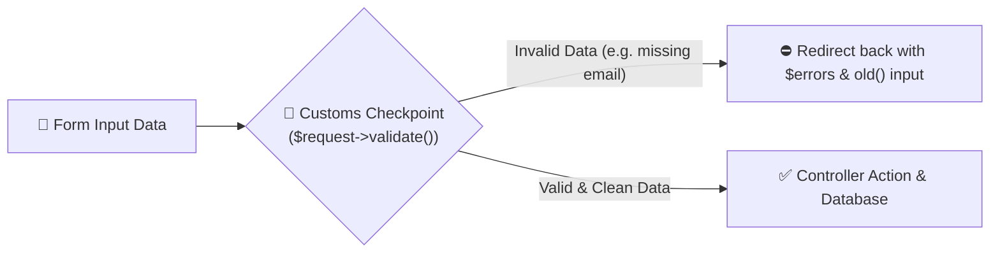

# 07 - Form Requests & Data Validation

## 🛂 The Airport Customs Inspection Analogy

Imagine traveling internationally:
Before you board the airplane or enter the country, customs officers inspect your baggage (Form Request / Validation Rules). If you carry prohibited items or missing documents, you are stopped immediately at the checkpoint before entering the city (Database).



In Laravel, **Form Requests** act as dedicated customs officers that inspect incoming HTTP POST/PUT requests before the Controller action runs.

---

## 💻 Code Deep Dive (`pgy_project`)

### Inline Validation vs Form Requests

#### 1. Inline Controller Validation
Used for smaller actions like [`PostController::store()`](file:///c:/Users/User/Desktop/My%20Coding%20Projects/pgy_project/app/Http/Controllers/PostController.php#L48-L55):

```php
$validatedData = $request->validate([
    'type'          => 'required|in:event_post,event_poll',
    'content'       => 'required|string|max:5000',
    'poll_options'  => 'required_if:type,event_poll|array',
    'expires_at'    => 'nullable|date|after:today',
]);
```

#### 2. Common Validation Rules Cheat Sheet

| Rule | Description | Example |
| :--- | :--- | :--- |
| `required` | Field must be present and not empty | `'name' => 'required'` |
| `nullable` | Field can be empty (`null`) | `'notes' => 'nullable'` |
| `email` | Must be a valid email address | `'email' => 'required\|email'` |
| `exists:table,column` | Must exist in MySQL database table | `'user_id' => 'exists:users,id'` |
| `unique:table,column` | Must NOT exist in MySQL table | `'username' => 'unique:users,username'` |
| `in:foo,bar` | Must match one of the listed values | `'role' => 'in:Admin,Staff,User'` |

---

## 💡 Junior Dev Takeaway
- If validation fails, Laravel **automatically redirects the user back** to the previous page with error messages `$errors` and preserves old inputs `old('field_name')`.
- You never need to write manual `if ($input == null) return error` blocks!
