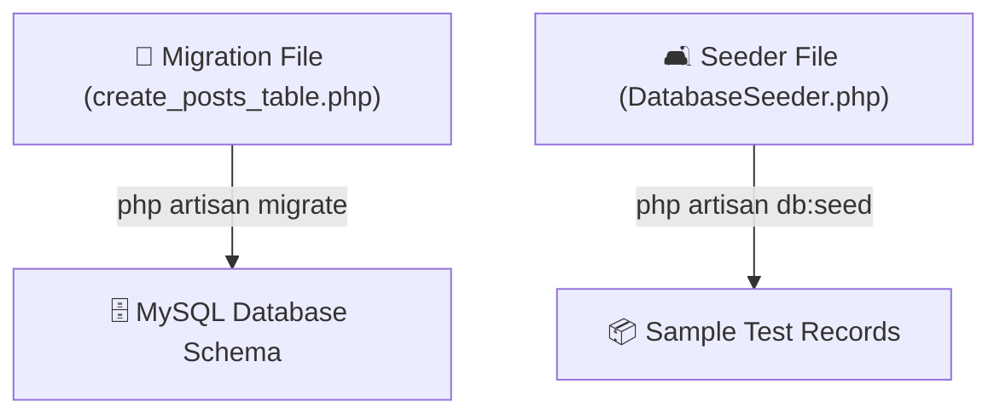

# 08 - Migrations & Database Seeding

## 📐 The Architectural Blueprint & Blueprint Automation Analogy

Imagine building a skyscraper:
- You don't just randomly lay bricks on day one. You draw **Architectural Blueprints (Migrations)** that define room dimensions, columns, and wiring.
- When new contractors join the construction site, instead of guessing what the floor plan looks like, they run the blueprint generator to build identical rooms automatically.
- **Seeding** is like placing sample dummy furniture into the rooms so designers can visualize the space immediately.



---

## 💻 Code Deep Dive (`pgy_project`)

### 1. Migrations (Version Control for your DB Schema)
Migrations allow developers to share and track database table schema changes without exporting `.sql` files.

Example Migration structure:
```php
use Illuminate\Database\Migrations\Migration;
use Illuminate\Database\Schema\Blueprint;
use Illuminate\Support\Facades\Schema;

return new class extends Migration
{
    public function up(): void
    {
        Schema::create('posts', function (Blueprint $table) {
            $table->id(); // Auto-increment PRIMARY KEY
            $table->foreignId('user_id')->constrained(); // Foreign key to users table
            $table->string('type');
            $table->text('content');
            $table->boolean('is_pinned')->default(false);
            $table->json('materials')->nullable();
            $table->timestamps(); // Creates created_at & updated_at columns!
        });
    }

    public function down(): void
    {
        Schema::dropIfExists('posts');
    }
};
```

### 2. Useful Artisan Terminal Commands

```bash
# Run pending migrations
php artisan migrate

# Rollback the last migration batch
php artisan migrate:rollback

# Wipe DB and re-run all migrations from scratch + seed sample data
php artisan migrate:fresh --seed
```

---

## 💡 Junior Dev Takeaway
- **Never modify database tables manually in phpMyAdmin / Navicat on shared/production databases!**
- Always create a migration (`php artisan make:migration create_xyz_table`) so your teammates can sync their databases effortlessly.
