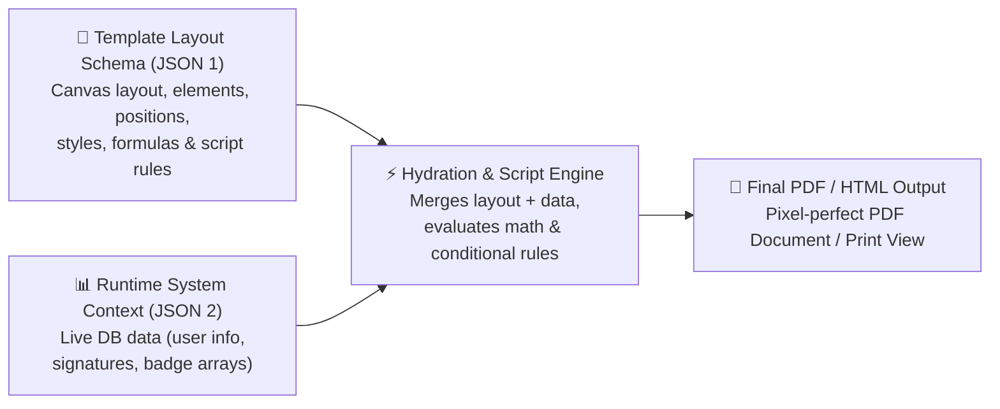

# Product Overview & 2-JSON Data Fusion Engine

The Template Designer is a visual drag-and-drop editor and dynamic document rendering engine for Laravel. It allows developers and template authors to visually design certificates, badges, invoices, and reports, bind live database fields, apply math formulas, and execute conditional visibility rules.

---

## The 2-JSON Fusion Architecture

The engine operates by **fusing two independent JSON structures** at render time to produce pixel-perfect HTML/PDF output:



---

## Concrete Data Fusion Example

### 1. JSON #1: Template Layout Schema (Saved by Canvas Editor)
```json
{
  "pages": [
    {
      "pageNumber": 1,
      "elements": [
        {
          "type": "variable",
          "placeholderId": "scoreTag",
          "expr": "@user.score",
          "style": { "left": 120, "top": 85, "width": 200, "height": 40 }
        },
        {
          "type": "placeholder",
          "placeholderId": "userSig",
          "dataField": "member_signature",
          "style": { "left": 400, "top": 300, "width": 180, "height": 80 }
        }
      ]
    }
  ],
  "script": "if @user.score >= 50 { SET $statusBadge VALUE \"CONGRATULATIONS! PASSED\" SET $statusBadge COLOR #28a745 } else { SET $statusBadge VALUE \"NEEDS IMPROVEMENT\" SET $statusBadge COLOR #dc3545 }"
}
```

### 2. JSON #2: Runtime System Context Data (Fetched from Database)
```json
{
  "user": {
    "name": "Tan Wei Ming",
    "name_en": "David Tan",
    "level": 5,
    "score": 85,
    "join_date": "2024-03-15"
  },
  "member_signature": "data:image/png;base64,iVBORw0KGgoAAAANSUhEUgAA...",
  "badges": {
    "list": [
      "https://example.com/badge1.png",
      "https://example.com/badge2.png"
    ]
  },
  "date": {
    "today": "2026-08-27"
  }
}
```

---

## Key Capabilities

- **Visual Canvas**: Position text boxes, images, badges, lines, shapes, and placeholders on standard A4 paper layouts (Portrait or Landscape).
- **Universal Tag ID System (`$ID`)**: Assign unique element tags (`$A`, `$scoreTag`, `$statusBadge`) to reference elements in formulas and script rules.
- **Dynamic Data Binding (`@var`)**: Type `@` in the editor to bind system fields (`@user.name`, `@user.score`).
- **Math & String Formula Engine**: Built-in math calculator (`@user.level * 2`) and string concatenation (`Str($A) + " - Level " + Str(@user.level)`).
- **Script Tool Engine**: Write conditional `if / else` logic directly in the editor to dynamically control element visibility and styles during output generation (`HIDE`, `SHOW`, `SET COLOR`, `SET BGCOLOR`, `SET VALUE`).
