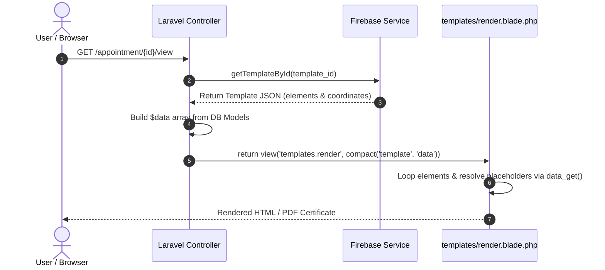
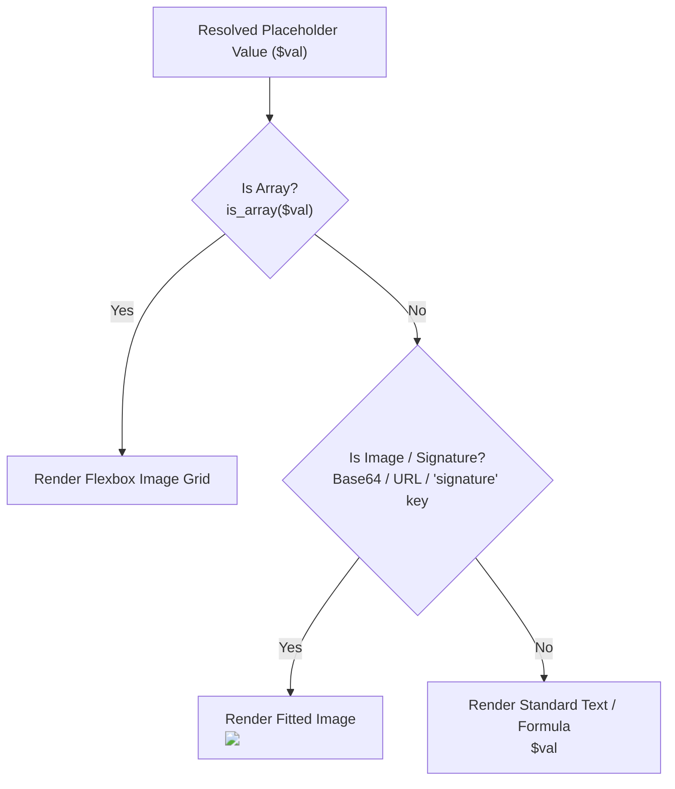

# Architecture & Data Placeholders

This guide details the internal rendering engine (`templates/render.blade.php`), data resolution pipeline, smart type detection, and developer usage of data placeholders.

---

## Target Audience & Developer Note

:::info[Developer-Oriented Tooling]
Although the Template Designer presents a visual UI that generates JSON on the client side, it is **intended for Developers**. 

End-users generally do not know the underlying database schemas, Controller data structures, or mapped variable paths (e.g., `user.name_en`, `position.name`, `date.signed_at`). Developers design templates by binding specific placeholder keys matching the Controller's data mapping (unless an attribute dictionary is exposed in the future).
:::

---

## System Architecture

The template system uses a strict separation between **visual layout JSON** (provided by Firebase/DB) and **runtime database data** (provided by the Controller).



---

## How Data Placeholders Work (`data_get`)

The rendering engine evaluates placeholders using Laravel's `data_get($data, $field)` helper:

```php
$field = $el['dataField'] ?? $el['expr'] ?? '';
$val   = data_get($data ?? [], $field, null);
```

### Dot-Notation Mapping Matrix

| Placeholder (`dataField`) | Controller Array Key Path | Example Output Value |
| :--- | :--- | :--- |
| `user.name` | `$data['user']['name']` | `张三` |
| `user.name_en` | `$data['user']['name_en']` | `Zhang San` |
| `position.name` | `$data['position']['name']` | `副团长` |
| `date.today` | `$data['date']['today']` | `2026-08-24` |
| `date.start_date` | `$data['date']['start_date']` | `2026年1月1日` |

---

## Smart Type Detection: Text vs. Signatures vs. Image Grids

`render.blade.php` dynamically inspects the resolved `$val` to determine whether to render text, an image/signature, or a multi-icon flexbox grid:



### Rendering Pipeline Logic:

```blade
@php
    $isImageData = is_string($val) && !empty($val) && (
        str_starts_with($val, 'data:image/') || // Base64 Canvas Signature
        str_starts_with($val, 'http://') ||      // External HTTP Image
        str_starts_with($val, 'https://') ||     // External HTTPS Image
        str_contains(strtolower($dataField), 'signature') // Signature Field
    );
@endphp

@if(is_array($val))
    {{-- Render Image Grid (e.g. Badges List) --}}
    <div class="badge-grid" style="z-index: 101;">
        @foreach($val as $item)
            
        @endforeach
    </div>
@elseif($isImageData)
    {{-- Render Base64 Signature or Image --}}
    
@else
    {{-- Render Standard Text / Formula Output --}}
    <div class="el-content" style="{{ $txtCss }}">{!! $val !!}</div>
@endif
```

---

## Adding Custom Data to Templates

To introduce new fields from other models (e.g., Public Event Registrations), add them to the `$data` array inside the respective Controller:

```php
$data['event'] = [
    'title' => $eventRegistration->title ?? '',
    'date'  => $eventRegistration->event_date ?? '',
];
```
Now, binding `event.title` in the Template Designer will resolve automatically.
