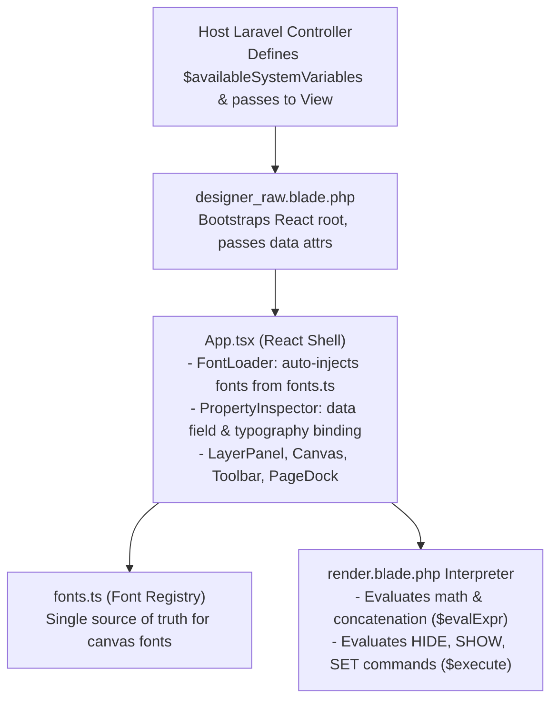

# Reusable Component & Package Architecture

This developer note describes how the Canvas Template Designer is structured as a plug-and-play, reusable Laravel component.

---

## Architecture Overview

The Template Designer is built to decouple the UI canvas from project-specific database models. This allows the editor and output renderer to be packaged or re-used across different projects or Laravel applications with zero core code modifications.



---

## 1. Unified Template Schema Registry (`TemplateSchemaService`)

To eliminate duplication across the Designer dropdown, the Renderer, and the Preview Mock generator, the system uses **`TemplateSchemaService`** as the single source of truth for template variables.

```php
use App\Services\TemplateSchemaService;

public function show(Request $request)
{
    $type = $request->query('type', 'Certificate');
    
    // Automatically retrieves categorized field metadata for the designer UI dropdown
    $availableSystemVariables = TemplateSchemaService::getDropdownVariables($type);

    return view('ad.designer_raw', [
        'template'                 => $template,
        'availableSystemVariables' => $availableSystemVariables,
    ]);
}
```

### Unified Schema Registry Structure (`TemplateSchemaService.php`):
Each template type (`appointment`, `certificate`, `testimonial`) defines its fields, user-friendly labels, and sample mock values in a single centralized array:

```php
'appointment' => [
    'name' => 'Appointment Certificate',
    'groups' => [
        'Appointment Data' => [
            'user.name' => [
                'label'  => 'Cadre Name (CN)',
                'sample' => '楷丰',
            ],
            'position.name' => [
                'label'  => 'Position Name (CN)',
                'sample' => '蒲公英精英团主席',
            ],
            'appointment.year' => [
                'label'  => 'Appointment Year',
                'sample' => '2026',
            ],
            'date.today' => [
                'label'  => "Today's Date",
                'sample' => '2026-09-09',
            ],
        ]
    ]
]
```

### Key Architectural Benefits:
1. **Zero Multi-File Duplication**: Adding or editing a field in `TemplateSchemaService` instantly reflects in:
   - The **Editor UI Dropdown** (`TemplateSchemaService::getDropdownVariables($type)`)
   - The **Editor Preview Mock Data Generator** (`TemplateSchemaService::getSamplePreviewData($type)`)
   - The **Interpreter / Renderer Output**
2. **Strict Variable Validation**: The Designer only lists valid, registered schema keys, preventing typos or invalid references.

---

## 2. View Component Integration

The global JS window configuration is initialized in `designer_raw.blade.php` before the script bundle loads:

```html
<script>
  window.AVAILABLE_SYSTEM_VARIABLES = @json($availableSystemVariables ?? []);
</script>
@vite(['resources/css/app.scss', 'resources/js/designer/main.tsx'])
```

The React `PropertyInspector` reads `window.AVAILABLE_SYSTEM_VARIABLES` to populate the data field dropdown — no hardcoded blade `<select>` is needed.

---

## 4. Font Registry (`fonts.ts` + `FontLoader.tsx`)

Canvas fonts are managed from a single config file — **`resources/js/designer/fonts.ts`**. The `FontLoader` React component reads this file on mount and auto-injects the necessary `<link>` and `<style>` tags.

**To add a font:**
1. Add an entry to `FONT_GROUPS` in `fonts.ts` with `googleFamily` (Google Fonts) or `fontFace` (self-hosted)
2. For self-hosted: drop the font file in `public/fonts/`
3. Update `render.blade.php` (PDF renderer is server-side PHP and cannot use React)
4. Run `npm run build`

No changes to `designer_raw.blade.php` are needed for the designer canvas.

---

## 5. JavaScript Autocomplete Integration

In `autocomplete.js`, typing `@` triggers `showAtSuggestions()`, which automatically scans `window.AVAILABLE_SYSTEM_VARIABLES`:

```javascript
function showAtSuggestions(input, matchIndex, query) {
    popup.innerHTML = '';
    const options = [];
    
    if (window.AVAILABLE_SYSTEM_VARIABLES && typeof window.AVAILABLE_SYSTEM_VARIABLES === 'object') {
        for (const [group, fields] of Object.entries(window.AVAILABLE_SYSTEM_VARIABLES)) {
            if (typeof fields === 'object' && fields !== null) {
                for (const [key, label] of Object.entries(fields)) {
                    options.push({ value: key, label: `${label} (${key})` });
                }
            }
        }
    }

    // Filter matching options and display autocomplete popup
}
```

---

## 6. Output Rendering at Runtime

When generating PDFs or HTML output, the host application passes its data array directly to `render.blade.php`:

```php
return view('templates.render', [
    'template' => $templateJsonData,
    'data'     => [
        'user' => [
            'name'  => 'John Doe',
            'score' => 95,
        ],
        'date' => [
            'today' => date('Y-m-d')
        ]
    ]
]);
```

The `render.blade.php` engine automatically handles:
- Variable interpolation (`@user.name`, `@user.score`)
- Canvas object formulas (`Str($A) + " - Passed"`)
- Dynamic Script rules (`HIDE $el7`, `SET $el7 COLOR #28a745`, `SET $el7 VALUE "PASSED"`)

---

## 7. Related Documentation & Guides

- **[Product Overview & 2-JSON Data Fusion Engine](./01-overview.md)** — Architectural introduction and JSON schema details.
- **[Frontend Module Architecture](./05-frontend-module-architecture.md)** — Component structure of the visual canvas editor.
- **[HTML Template Renderer vs DOCX Preview](../document-rendering/01-renderer-vs-docx-preview.md)** — Runtime render engines compared.

