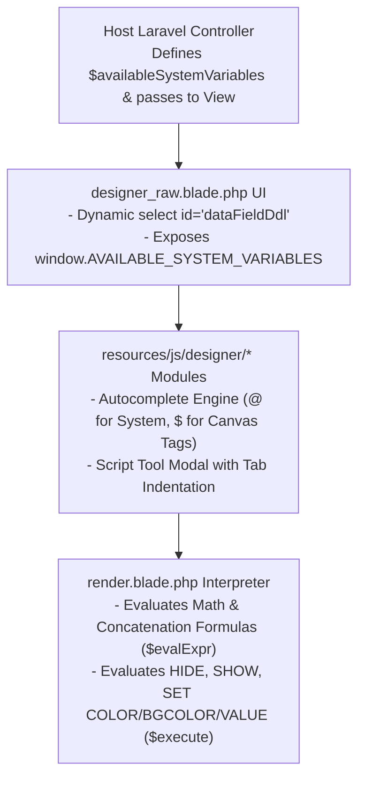

# Reusable Component & Package Architecture

This developer note describes how the Canvas Template Designer is structured as a plug-and-play, reusable Laravel component.

---

## Architecture Overview

The Template Designer is built to decouple the UI canvas from project-specific database models. This allows the editor and output renderer to be packaged or re-used across different projects or Laravel applications with zero core code modifications.



---

## 1. Controller Data Variable Provider

Developers pass available system fields to the template editor view as a nested array:

```php
use App\Http\Controllers\AD\TemplateEditorController;

public function edit(Request $request, $id)
{
    $template = Template::findOrFail($id);
    
    // Get fields based on template type or pass custom array
    $availableSystemVariables = TemplateEditorController::getAvailableSystemVariables($request->query('type'));

    return view('ad.designer_raw', [
        'template'                 => $template,
        'availableSystemVariables' => $availableSystemVariables,
    ]);
}
```

### Array Structure:
```php
[
    'Category Group Name' => [
        'data.field.path' => 'User Friendly Label',
        'user.name'       => 'User Full Name',
        'user.score'      => 'Total Score',
    ],
    'System & Dates' => [
        'date.today'      => 'Today\'s Date',
    ]
]
```

---

## 2. View Component Integration

In `designer_raw.blade.php`, the dropdown builds dynamically without hardcoded `@if` rules:


```blade
<select class="property-input" id="dataFieldDdl" onchange="onPlaceholderFieldChange()">
  <option value="">-- Select Field --</option>
  @if(isset($availableSystemVariables) && is_array($availableSystemVariables))
    @foreach($availableSystemVariables as $groupLabel => $fields)
      <optgroup label="{{ $groupLabel }}">
        @foreach($fields as $fieldKey => $fieldLabel)
          <option value="{{ $fieldKey }}">{{ $fieldLabel }} ({{ $fieldKey }})</option>
        @endforeach
      </optgroup>
    @endforeach
  @endif
</select>
```

The global JS window configuration is initialized right before importing the main script:

```html
<script>
  window.AVAILABLE_SYSTEM_VARIABLES = @json($availableSystemVariables ?? []);
</script>
<script src="{{ asset('js/template.js') }}"></script>
```

---

## 3. JavaScript Autocomplete Integration

In `autocomplete.js`, typing `@` triggers `showAtSuggestions()`, which automatically scans `window.AVAILABLE_SYSTEM_VARIABLES`:

```javascript
function showAtSuggestions(input, matchIndex, query) {
    popup.innerHTML = '';
    const options = [];
    
    if (window.AVAILABLE_SYSTEM_VARIABLES && typeof window.AVAILABLE_SYSTEM_VARIABLES === 'object') {
        for (const [group, fields] of Object.entries(window.AVAILABLE_SYSTEM_VARIABLES)) {
            if (typeof fields === 'object' && fields !== null) {
                for (const [key, label] of Object.entries(fields)) {
                    options.push({ value: key, label: `${label} (${key})` });
                }
            }
        }
    }

    // Filter matching options and display autocomplete popup
}
```

---

## 4. Output Rendering at Runtime

When generating PDFs or HTML output, the host application passes its data array directly to `render.blade.php`:

```php
return view('templates.render', [
    'template' => $templateJsonData,
    'data'     => [
        'user' => [
            'name'  => 'John Doe',
            'score' => 95,
        ],
        'date' => [
            'today' => date('Y-m-d')
        ]
    ]
]);
```

The `render.blade.php` engine automatically handles:
- Variable interpolation (`@user.name`, `@user.score`)
- Canvas object formulas (`Str($A) + " - Passed"`)
- Dynamic Script rules (`HIDE $el7`, `SET $el7 COLOR #28a745`, `SET $el7 VALUE "PASSED"`)

---

## 5. Related Documentation & Guides

- **[Product Overview & 2-JSON Data Fusion Engine](./01-overview.md)** — Architectural introduction and JSON schema details.
- **[Frontend Module Architecture](./05-frontend-module-architecture.md)** — Component structure of the visual canvas editor.
- **[HTML Template Renderer vs DOCX Preview](../document-rendering/01-renderer-vs-docx-preview.md)** — Runtime render engines compared.

