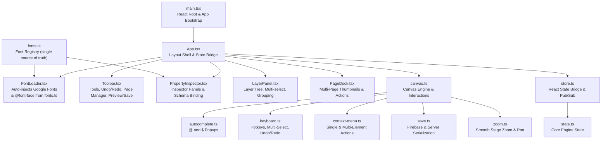

# Frontend React + TypeScript Module Architecture

This guide documents the React and TypeScript architecture of the Canvas Template Designer located in `resources/js/designer/`.

---

## 1. Module Map

---

## 2. Component & Module Responsibilities

### `main.tsx` & `App.tsx` (React Root Shell)
Mounts the React application into `#template-designer-root`, initializes global listeners, and connects all panels.

### `FontLoader.tsx` (Automatic Font Injector)
Reads `FONT_GROUPS` from `fonts.ts` at runtime and injects:
- A `<link>` tag to Google Fonts CDN for all Google-hosted fonts
- A `<style>` block with `@font-face` rules for self-hosted fonts (e.g. `思源宋体 Bold`)

**To add a font:** edit `fonts.ts` only — no blade files need to be touched for the designer.

### `fonts.ts` (Font Registry)
Single source of truth for available canvas fonts. Each entry declares:
- `label` — dropdown display name
- `value` — CSS `font-family` string stored in Firebase
- `googleFamily` — (optional) Google Fonts family query segment
- `fontFace` — (optional) self-hosted font config (`src`, `format`, `weight`, `style`)

### `PropertyInspector.tsx` (Inspector Panel & Variable Binding)
Reads the selected canvas element and renders:
- **System Variable binding**: Scalar data field dropdown for `placeholder` elements.
- **List Data binding**: List fields dropdown for `dataGrid` (`DataList`) and `imageGrid` (`ImageList`).
- **Typography card**: Font family (dropdown rendered from `fonts.ts`), size, alignment, bold/italic, color (applies to `text`, `placeholder`, `variable`, `dataGrid`, and `expressionGrid`).
- **Variable & List expressions**: Formula inputs and modal dialog launcher for `variable` and `expressionGrid` (`ExprList`).
- **Grid Layout controls**: Flow direction (`LR`, `RL`, `TD`, `DT`), item gap, auto wrap, item dimensions, and `Filter Value` modal.
- **Fill & Border controls**: Background color, solid vs transparent toggle, border width (px), and border color.

Font dropdown uses fuzzy matching (`matchFontOption()` from `fonts.ts`) to resolve browser-normalized `font-family` strings back to their canonical option value.

### `LayerPanel.tsx` (Layers & Group Dock)
- Multi-element selection and bulk grouping/deletion.
- Layer reordering via drag-and-drop.
- Group folders, locking, and visibility toggling.
- **Layer Renaming**: Double-clicking any layer item opens the rename dialog. Context-menu rename captures the target element reliably before prompting.
- Context menu with viewport boundary clamping and scroll-tracking.

### `canvas.ts` (Canvas Engine)
Handles DOM canvas interactions:
- Element creation, selection, bounding box, multi-point resize handles.
- Dragging, keyboard nudging (with Shift acceleration), canvas coordinate math.
- Element types: `text`, `image`, `dataImage`, `placeholder`, `variable`, `imageGrid`, `dataGrid`, `expressionGrid`, `line`, `rectangle`, `circle`.
- **Default 0px Borders**: All objects default to 0px borders (`0 solid transparent`).
- Double-clicking `variable` or `expressionGrid` elements opens the Expression Editor.

Text (`textarea`) elements are editable on click. Variable, DataList, and Expression elements are live-previewed on canvas and evaluated at render time.

### `save.ts` (Serialization & Load Engine)
- Serializes multi-page state to JSON (Firebase Realtime DB + Laravel save API).
- Serializes custom layer names (`name`), grid layout parameters (`layoutOrder`, `autoWrap`, `itemGap`, `itemWidth`, `itemHeight`), filter rules (`skipRules`), and typography attributes (`text`).
- Undo/Redo history stack with non-disorienting view retention.

---

## 3. Related Documentation & Guides

- **[Product Overview & 2-JSON Data Fusion Engine](./01-overview.md)** — Architectural design and data fusion pipeline.
- **[Reusable Component & Package Architecture](./03-reusable-package-architecture.md)** — Integrating the frontend module into host controllers.
- **[Scripting Language Syntax](./04-template-scripting-language-syntax.md)** — Integrated conditional tool syntax.
