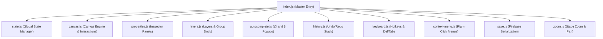

# Frontend ES6 Module Architecture

This guide documents the modular ES6 JavaScript architecture of the Canvas Template Designer located in `resources/js/designer/`.

---

## 1. Modular Architecture Overview

To maintain high code quality and scalability, the Template Designer frontend is split into 11 ES6 modules compiled via Vite/Laravel Mix:

---

## 2. Visual Interface Layout

The modular JavaScript architecture powers the visual drag-and-drop editor workspace:

---

## 3. Module Responsibilities

### `index.js` (Master Entry Point)
Initializes global event listeners, bootstraps the editor DOM, loads initial template JSON data, and binds toolbar buttons.

### `state.js` (State Manager)
Maintains global application variables (`window.elements`, `window.pages`, `window.selectedElement`, `window.historyStack`). Provides helper getters and setters.

### `canvas.js` (Canvas Engine)
Handles HTML5 canvas interactions:
- Element selection, bounding box calculations, resize handles (N, S, E, W, NE, NW, SE, SW).
- Drag movement with grid snapping.
- Rendering element nodes (Text, Image, Placeholder Variable, Signature, Line, Rectangle, Circle).

### `properties.js` (Inspector Panels)
Binds canvas selection to the right-hand Inspector Panel:
- Typography (Font Family, Size, Weight, Alignment, Color).
- Fill & Stroke (Background Color, Border Width, Border Color, Opacity).
- Data Field Mapping & Math Formulas (`dataField`, `expr`).
- Canvas Element Tag ID (`$TagID`).

### `layers.js` (Layers & Group Folders)
Manages the left-side Layer Dock:
- Reordering layers via HTML5 Drag and Drop API.
- Group Folder creation, collapse/expand states, and Group Tag IDs.
- Visibility toggling (Eye icon) and Lock/Unlock state.

### `autocomplete.js` (Dual Symbol Autocomplete)
Monitors input fields and textareas for `@` and `$` triggers:
- Typing `@`: Populates available system variables from `window.AVAILABLE_SYSTEM_VARIABLES`.
- Typing `$`: Populates canvas element Tag IDs (`$A`, `$scoreBadge`) and Group Tag IDs (`$headerFolder`).

### `history.js` (Undo/Redo Stack)
Pushes state snapshots to `historyStack` on element mutations. Supports `undo()` and `redo()` actions via `Ctrl+Z` / `Ctrl+Y`.

### `save.js` (Firebase Serialization)
Serializes the current canvas state into the 2-JSON Layout Schema format and transmits payload updates to Firebase Realtime Database / Laravel backend APIs.

---

## 4. Related Documentation & Guides

- **[Product Overview & 2-JSON Data Fusion Engine](./01-overview.md)** — Architectural design and data fusion pipeline.
- **[Reusable Component & Package Architecture](./03-reusable-package-architecture.md)** — Integrating the frontend module into host controllers.
- **[Scripting Language Syntax](./04-template-scripting-language-syntax.md)** — Integrated conditional tool syntax.

