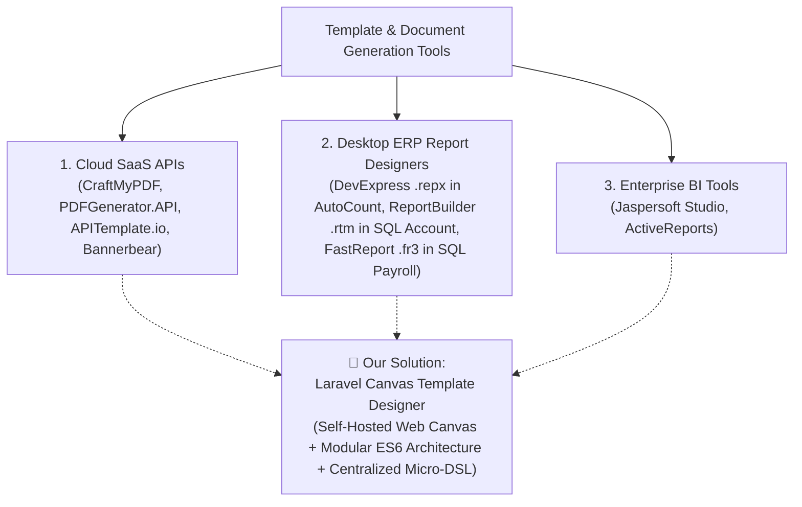
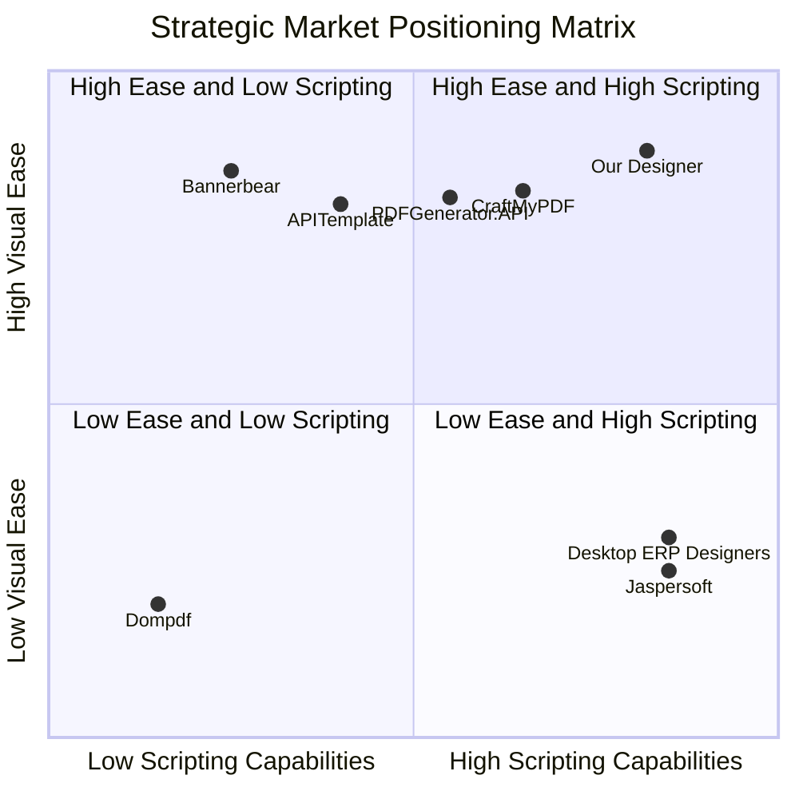

# Comprehensive Competitor Analysis & Market Positioning

**Document Overview**: This document provides a detailed comparative analysis between the **Laravel Canvas Template Designer** and existing commercial SaaS applications (CraftMyPDF, PDFGenerator.API, APITemplate.io, Bannerbear), enterprise desktop reporting systems (e.g. DevExpress Reports in AutoCount, ReportBuilder in SQL Account/Sage UBS, FastReport in SQL Payroll), and developer libraries.

---

## 1. Competitor Landscape Overview

The market for template design and document generation is split into four main categories:

---

## 2. Deep-Dive Competitor Analysis

### Category A: Commercial Cloud SaaS APIs

#### 1. CraftMyPDF (Closest Direct Competitor)
- **Target Audience**: Developers looking for visual PDF generation via REST API.
- **Core Mechanism**: Drag-and-drop web builder. Elements support individual expression rules like `show_if(data.score >= 50)`.
- **Pros**: Clean UI, good PDF preview, basic expression evaluation.
- **Cons**: No centralized script tool, $19–$99/mo subscription, no dynamic style mutation rules (`SET COLOR`) without element duplication.

#### 2. PDFGenerator.API (Direct Competitor in Visual Expression Space)
- **Target Audience**: Web applications and ERP integrations needing template generation.
- **Core Mechanism**: Web template builder supporting data mapping and basic conditional expressions (`if_empty`, `show_if`).
- **Pros**: Good visual editor, multi-format export capabilities.
- **Cons**: 
  - **No Central Script Language**: Expressions are typed per-element in small input fields.
  - **Expensive SaaS Pricing**: $29/mo – $150/mo.
  - **Data Privacy**: Requires pushing customer payloads to third-party servers.

---

### Category B: Desktop ERP & Accounting Report Designers

#### 3. DevExpress Reports (`.repx`), ReportBuilder (`.rtm`), and FastReport (`.fr3`)
- **Target Audience**: Desktop accounting software, ERP suites:
  - **DevExpress Reports (`.repx`)**: Used natively by **AutoCount**.
  - **Digital Metaphors ReportBuilder (`.rtm`)**: Used natively by **SQL Account** and **Sage UBS**.
  - **FastReport (`.fr3`)**: Used by **SQL Payroll** and Windows ERP suites.
- **Core Mechanism**: Visual desktop band/canvas designer embedded inside accounting software. Contains integrated scripting engines (C#/PascalScript) for dynamic events (`OnBeforePrint`).
- **Pros**: Extremely powerful multi-band layout, sub-reports, and event-driven script control.
- **Cons**: Desktop-Only Technologies, complex C#/Pascal syntax, proprietary OEM licensing.

---

## 3. Feature Comparison Matrix

| Feature / Capability | CraftMyPDF | PDFGenerator.API | Desktop ERP Designers (AutoCount / SQL Account) | Jaspersoft | **Our Solution (Laravel Designer)** |
| :--- | :---: | :---: | :---: | :---: | :---: |
| **Web Browser Canvas UI** | ✅ | ✅ | ❌ (Windows Desktop) | ❌ (Desktop) | **✅ (100% Web Native)** |
| **Modular ES6 Architecture** | ❌ (Cloud Bundle) | ❌ (Cloud Bundle) | ❌ | ❌ | **✅ (`resources/js/designer/*`)** |
| **Flexible Deployment Options** | ❌ (Cloud Only) | ❌ (Cloud Only) | ❌ (Desktop Only) | ✅ | **✅ (Self-Hosted OR Cloud SaaS)** |
| **In-Editor Scripting Engine** | ❌ (Per-Element) | ❌ (Per-Element) | ✅ (C#/PascalScript) | Limited | **✅ (Central EBNF Micro-DSL)** |
| **Dynamic Style Overrides (`SET COLOR`)** | ❌ | ❌ | ✅ (`Text1.Color`) | ❌ | **✅ (`SET $ID COLOR/BGCOLOR`)** |
| **Dual Autocomplete (`@` & `$`)** | ❌ | ❌ | ❌ | ❌ | **✅ (`@var` & `$tag`)** |
| **Smart Type Detection (Text/Sig/Grid)** | ❌ | ❌ | ❌ | ❌ | **✅ (Automatic)** |
| **Formula Engine (`Str($A) + Str($B)`)** | Limited | Limited | ✅ | ✅ | **✅ (Built-in Evaluator)** |

---

## 4. Scripting Language Deep-Dive: Comparative Analysis Across All Platforms

| System | Underlying Script Language | Code Structure & Placement | Learning Curve | Target User |
| :--- | :--- | :--- | :---: | :--- |
| 🚀 **Our Laravel Designer** | **Restricted EBNF Micro-DSL** | **Centralized Script Tool Modal** | **Extremely Low** | Web Designers, Admins & Developers |
| 🔷 **CraftMyPDF** | JS Helper Functions (`show_if`) | Scattered per-element textboxes | Medium-Low | Web Developers |
| 🟧 **PDFGenerator.API** | Expression Flags (`if_empty`) | Scattered per-element textboxes | Medium-Low | Integrators |
| ⚙️ **AutoCount (.repx)** | Compiled C# (.NET) | Event Handlers (`BeforePrint`) | **High** | C# Software Engineers |
| ⚙️ **SQL Account (.rtm)** | PascalScript (Delphi) | Event Handlers (`OnBeforePrint`) | **High** | Delphi Report Consultants |
| ⚙️ **SQL Payroll (.fr3)** | PascalScript (FastReport) | Event Handlers (`OnBeforePrint`) | **High** | Delphi Report Consultants |
| ☕ **Jaspersoft Studio** | Java / Groovy / BeanShell | Property Expression Fields | **High** | Enterprise Java Engineers |
| 🎨 **APITemplate.io** | Handlebars (`{{#if}}`) | Embedded HTML template tags | Medium | Web Developers |
| 🐻 **Bannerbear** | **No Script Engine** | N/A (PHP/Python API payload) | N/A | Backend Developers |

---

## 5. Strategic Market Positioning & Scorecard

