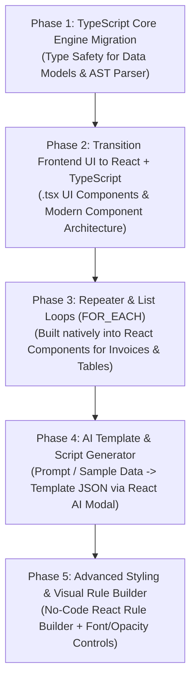

# Feature Expansion & Execution Roadmap

This document outlines the current capabilities, prioritized execution strategy, and multi-phase roadmap for the Canvas Template Designer & Output Rendering Engine.

---

## 1. Current System Architecture & Capabilities

### Data Tokens & Tag Identifiers
- **`@system.variable`**: Live system data fields resolved at render runtime (e.g. `@user.score`, `@user.level`, `@user.name`, `@date.today`).
- **`$CanvasTagID`**: Element Tag IDs assigned to individual canvas elements in the designer (e.g. `$A`, `$scoreBadge`, `$statusBox`).
- **`#hexcolor`**: Standard CSS hex color codes (e.g. `#28a745`, `#dc3545`, `#fff3cd`).

### Dynamic System Variable Provider Pattern (Package Ready)
Data variables are passed as a structured array `$availableSystemVariables` from the controller (`TemplateEditorController::getAvailableSystemVariables($type)`):
```php
[
    'User Info' => [
        'user.name'  => 'User Name',
        'user.level' => 'User Level',
    ],
    'System' => [
        'date.today' => "Today's Date",
    ]
]
```
The Blade template dynamically populates the `<select>` dropdown and exposes `window.AVAILABLE_SYSTEM_VARIABLES` to JavaScript for `@` popup autocomplete suggestions.

### Formula & Expression Engine
- **Math Expressions**: `Str(@user.level) * 2 + 5`
- **String Concatenation**: `Str($A) + " - Level " + Str(@user.level)`
- **Literal Quotes**: `'Literal string inside quotes'` or `"Double quote literal"`

### Template Script Tool Commands
| Command | Example | Description |
| :--- | :--- | :--- |
| `HIDE $ID` | `HIDE $elementBox` | Hides the targeted element from visual output. |
| `SHOW $ID` | `SHOW $elementBox` | Forces rendering of a hidden element. |
| `SET $ID COLOR <color>` | `SET $scoreTag COLOR #28a745` | Dynamically overrides element text color. |
| `SET $ID BGCOLOR <color>` | `SET $badgeCard BGCOLOR #d4edda` | Dynamically overrides element background color. |
| `SET $ID VALUE <val>` | `SET $statusText VALUE "PASSED"` | Dynamically overrides element text / content value. |

---

## 2. Prioritized Execution Sequence & Strategic Roadmap

**React + TypeScript Transition** being in Phase 2 avoids building new complex features (like repeaters, rule builders, and AI dialogs) twice in plain DOM JavaScript before re-writing them in React.



---

### Phase 1: Immediate Technical Focus — TypeScript Core Engine Migration
* **Goal**: Establish type safety, robust AST testing, and compile-time bug prevention in the core engine before UI refactoring.
1. **TypeScript Migration**: Convert core engine JavaScript modules in `resources/js/designer/` to `.ts` (`state.ts`, `ast.ts`, `script.ts`). Define strict interfaces for `CanvasElement`, `CanvasState`, and `ASTNode`.
2. **AST Parser Unit Tests**: Create unit test coverage for the Script Interpreter parser (`HIDE`, `SHOW`, `SET`, logic conditionals) to prevent runtime syntax evaluation bugs.
3. **Headless PDF Microservice**: Set up a Node.js Puppeteer/Browsershot endpoint for pixel-perfect server-side rendering.

---

### Phase 2: Transition Frontend UI to React + TypeScript (`.tsx`)
* **Goal**: Rebuild the frontend UI layer into modern React + TypeScript (`.tsx`) components before adding heavy new feature suites.
* **Key Benefits**:
  - Eliminates manual DOM manipulation for complex UI state.
  - Builds reusable component architecture (`<Toolbar />`, `<LayerPanel />`, `<PropertyInspector />`, `<CanvasContainer />`).
  - Prepares the app for commercial SaaS embedding & NPM package distribution (`@yourbrand/template-designer-react`).

---

### Phase 3: Repeater & List Loops (`FOR_EACH`)
* **Goal**: Enable dynamic repeating grids and tables for invoices, transaction logs, and gallery items directly inside the React element renderer.
* **Syntax Concept**:
  ```text
  FOR_EACH @user.badges {
      CLONE $badgeItemCard
  }
  ```

---

### Phase 4: AI-Powered Template & Script Generator (Killer Feature)
* **Goal**: Allow users to input sample JSON data or a text prompt, producing a complete visual template + conditional script automatically using Gemini API (Structured JSON Mode) via an interactive React AI Modal component.
* **Technical Flow**:
  1. User inputs sample JSON schema or text prompt in React `<AiGeneratorModal />`.
  2. Backend passes JSON schema to Gemini API.
  3. AI returns valid `templateDataJson`.
  4. Designer calls `loadTemplate(json)` to render canvas elements & populates script editor.

---

### Phase 5: Advanced Styling & Visual Rule Builder UI
1. **Advanced Script Commands**: `SET $ID FONTSIZE 18px`, `SET $ID OPACITY 0.5`, `SET $ID BORDER "2px solid #0078d4"`.
2. **Visual Rule Builder**: Drop-down / click-and-select React component (`<RuleBuilder />`) alongside the text script editor (`If [ @user.score ] [ >= ] [ 50 ] -> [ SHOW ] [ $passBadge ]`).
3. **Dynamic Background & Multi-Page Drop Controls**: `SET_BACKGROUND`, `DROP_PAGE`.
