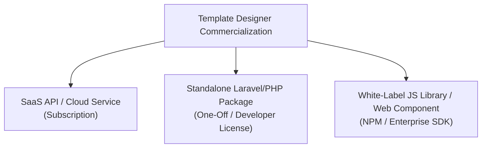

# Commercialization & Architectural Evaluation

**Target Component:** Visual Canvas Template Designer & Script interpreter engine (`resources/js/designer/`, `TemplateEditorController.php`, `TEMPLATE_DESIGNER_ROADMAP.md`)

---

## 1. Executive Summary

The **Template Designer & Script Engine** is a high-value software asset. Unlike generic drag-and-drop graphic editors (e.g. Canva clones), this system combines a **Visual Canvas Editor** with a **Dynamic Variable Provider Pattern** and a **Conditional Script Logic Engine (`HIDE`, `SHOW`, `SET COLOR/VALUE`)**.

This transforms the editor into an automated **Dynamic Document, Certificate, Badge, and Report Generation Engine**.

---

## 2. Market Demand & Commercialization Viability

### Target Market & Use Cases
1. **SaaS Application Builders**: HR platforms, LMS (learning management), e-commerce, and event management platforms needing dynamic certificate, badge, invoice, and report generators for their end-users.
2. **Enterprise Document Automation**: Organizations needing dynamic multi-page document/PDF generation driven by complex business rules without developer involvement for every template tweak.
3. **White-Label OEM Integrations**: Product teams seeking an embedded visual template designer SDK within their own applications.

### Competitor Landscape & Industry Proof
* **APITemplate.io / CraftMyPDF / PDFMonkey**: Drag-and-drop template designer for PDFs/Images with API integration ($29–$299+/month).
* **Bannerbear**: Dynamic image/PDF generation via API ($49–$299+/month).
* **Carbone.io**: Report generator ($0.001/render or self-hosted enterprise tier).

---

## 3. Monetization & Business Models

1. **Standalone Micro-SaaS (API + Host Engine)**:
   * Users build templates visually, define data tokens, and call `POST /api/v1/render` with a JSON payload to receive high-res PDFs or PNGs.
   * **Monetization**: Tiered monthly subscriptions ($29/mo for 1,000 renders, $99/mo for 10,000 renders, $299/mo enterprise).
2. **Commercial Laravel Package / Plugin**:
   * Package as a self-hosted Composer package (`vendor/template-designer`) for Laravel developers.
   * **Monetization**: One-off lifetime developer license ($99–$249/site or developer license) via CodeCanyon, Spatie-style marketplace, or private store.
3. **Embeddable NPM Component (React / Web Component / Vanilla)**:
   * Sell frontend UI SDK for software vendors looking to give their users document editing capabilities.

---

## 4. Evaluation of Technical Stack: Pure Vanilla JS vs. Frameworks (React/Vue)

### Is Pure Vanilla JS bad for the future?

> **Verdict**: **No, Vanilla JS is NOT bad for initial building.** In fact, for canvas editors and embeddable widgets, pure Vanilla JS or Web Components can be a huge competitive advantage for zero-dependency embedding. However, transitioning to React + TypeScript in Phase 2 simplifies complex UI state management (toolbars, layer trees, AI modals).

### Comparison Table

| Aspect | Pure Vanilla JS (Current Stack) | React / Vue / Svelte |
| :--- | :--- | :--- |
| **Embeddability** | **Extremely High**: Zero external dependencies. Fits into Laravel Blade, Django, Rails, React, or plain HTML. | **Medium**: Requires NPM, build tooling (Vite/Webpack), and a React runtime context inside host apps. |
| **Performance & Bundle Size** | **Ultra-Lightweight**: Minimal bundle size (~50-100KB), instant load times. | **Larger**: ~200KB+ runtime bundle size. |
| **State & UI Sync Complexity** | **Requires Discipline**: Handled via custom state containers (`state.js`) and DOM bindings. | **Declarative**: Built-in reactive state management for complex property panels. |
| **Target Audience Fit** | **Ideal for Laravel/PHP Packages** (PHP devs dislike forced Node/React dependencies). | **Ideal for Standalone SaaS SPA Web Apps**. |

---

## 5. IP Protection & Commercial Security

A common concern when building frontend JavaScript tools is whether users can copy your code.

### The Truth About Frontend IP Protection:
1. **Frontend UI vs. Backend Engine**:
   * What runs in the browser is only the UI Canvas (`resources/js/designer/`).
   * What runs on your server (PHP/Python) is the **Script Tokenizer & AST Interpreter**, data provider security, template database, and high-resolution PDF rendering engine.
   * Without your backend interpreter, a copied frontend canvas cannot generate PDFs or documents.
2. **Minification & Obfuscation**:
   * Production JS is bundled and obfuscated via Terser/Vite into an unreadable mangled single-line file. Reverse-engineering obfuscated code is far more expensive than purchasing a license.
3. **Enterprise Compliance**:
   * Legitimate companies buy official licenses to receive updates, support, and avoid copyright liability.

---

## 6. Actionable Refinement Checklist

- [ ] **Type Safety**: Convert `resources/js/designer/` modules to `.ts` (TypeScript).
- [ ] **AST Unit Testing**: Write unit test coverage for the Template Script Interpreter (`HIDE`, `SHOW`, `SET`, logic parser).
- [ ] **React UI Migration**: Transition the UI layout to React + TypeScript (`.tsx`) components in Phase 2.
- [ ] **Repeater Loops**: Implement Phase 3 (`FOR_EACH` collection renderer) for invoice/table support.
- [ ] **AI Generator**: Implement Phase 4 Gemini AI Template & Script generator.
- [ ] **Headless Render Microservice**: Set up a Node.js Puppeteer / Browsershot renderer endpoint for high-resolution PDF generation.
