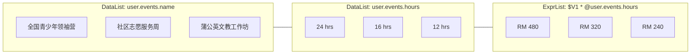

# List Data & Repeater Elements (DataList, ImageList, ExprList)

This guide documents the usage, design workflows, formula calculation rules, typography styling, and conditional item filtering for list-based repeater elements in the Template Designer (`DataList`, `ImageList`, and `ExprList`).

---

## 1. Document Detail / Repeater Paradigm

In document generation (such as invoice line items, camp attendance records, event rosters, or merit badge galleries), data naturally repeats across multiple rows or cards.

Rather than configuring rigid multi-column table objects, the Template Designer uses a **Single-Field Column / Document Detail** repeater paradigm:
- **One Field &rarr; Multiple Values**: Each `DataList` or `ImageList` element binds to an array of scalar values or image URLs.
- **Parallel Document Columns**: Placing two or more `DataList` elements side-by-side (e.g. `user.events.name` and `user.events.hours`) cleanly forms an invoice / report table structure with independent styling and layout alignments.



---

## 2. Element Types & Capabilities

| Element Tool | Binding Category | Target Data Shape | Example Binding / Formula |
| :--- | :--- | :--- | :--- |
| **`DataList`** (`fa-list`) | `list_data` | Array of scalar values (strings, numbers) | `user.events.name` &rarr; `["Camp A", "Camp B"]` |
| **`ImageList`** (`fa-images`) | `list_image` | Array of image URLs or badge objects with `imageUrl` | `user.badges` &rarr; `[{title: "Gold", imageUrl: "..."}]` |
| **`ExprList`** (`fa-list-ol`) | `list_data` | Evaluated formula applied row-by-row across list items | `$V1 * @user.events.hours` or `@item * 2` |

---

## 3. How to Use ExprList (Formulas & Double-Click Editor)

`ExprList` operates like a multi-row spreadsheet formula calculated across repeater items.

### 3.1 Editing the Formula
- **Double-Click on Canvas**: Double-clicking an `ExprList` element directly opens the modal Expression Formula Editor with full syntax highlighting and autocomplete.
- **Properties Inspector**: You can also edit the formula directly in the `Expression Formula` input or click **"Edit Formula in Dialog"**.

### 3.2 Calculation Rules & Variables
Formulas in `ExprList` can combine:
1. **Canvas Variables (`$TagID`)**: Scalar canvas tags (e.g. `$V1` where `$V1` is an hourly rate of `20`).
2. **System List Variables (`@user.events...`)**: Repeating list fields (e.g. `@user.events.hours`).
3. **Current Row Item (`@item` or `@item.property`)**: Represents the individual row value.
4. **Scalar System Fields (`@user.rate`)**: Any scalar field from the backend data schema.

> [!IMPORTANT]
> **Validation Constraint**:
> - An `ExprList` formula **must contain at least one list data variable** (`list_data` or `@item`). If only scalar variables are provided, validation will flag an error because a list calculation requires repeating items.
> - **Image Lists (`list_image`)** cannot be used in arithmetic expressions.

*Example Calculation:*
```text
$hourlyRate * @user.events.hours
// If $hourlyRate = 25 and hours = [10, 20, 5], output is [250, 500, 125]
```

---

## 4. Typography & Appearance Styling

Both `DataList` and `ExprList` support full typography configuration in the **Properties Inspector**:

- **Font Family**: Select from Google Fonts or system fonts (e.g., Arial, Playfair Display, Cinzel, Noto Sans SC).
- **Font Size & Weight**: Adjust text size and toggle Bold / Italic.
- **Text Alignment**: Left, Center, or Right alignment.
- **Text Color**: Custom Hex / Color picker with transparent option.
- **Live Canvas Preview**: Any typography adjustment instantly updates the canvas sample rows (`Value Item #1`, `= $expr`), matching the PDF output accurately.

---

## 5. Layout Direction & AutoWrap Controls

List elements provide dynamic layout flow controls:

### 5.1 Directional Flows (`layoutOrder`)
- **`TD` (Top to Down)**: Standard vertical column order (recommended for invoice tables and lists).
- **`DT` (Down to Top)**: Inverted vertical column order.
- **`LR` (Left to Right)**: Horizontal row flow (ideal for merit badge ribbons or horizontal tag galleries).
- **`RL` (Right to Left)**: Inverted horizontal row flow.

### 5.2 AutoWrap & Item Spacing
- **Auto Wrap ON (`autoWrap = true`)**: Items automatically wrap into new lines/columns within the element's bounding box.
- **Auto Wrap OFF (`autoWrap = false`)**: Single-line flow; items that overflow the bounding box are clipped cleanly.
- **Item Gap (`itemGap`)**: Configurable pixel spacing between rows or items (e.g., `4px`, `8px`).
- **Item Size (`itemWidth` & `itemHeight`)**: (*ImageList only*) Specific thumbnail dimensions for gallery items.

---

## 6. Per-Item Filter Rules (`Filter Value` / `SKIP VALUE IF`)

To omit specific items from repeating in the generated document (e.g. inactive events or zero-hour entries), authors can add filter rules via the **"Filter Value"** button:

```text
SKIP VALUE IF (@item.status == "inactive")
SKIP VALUE IF (@item.hours <= 0)
SKIP VALUE IF (@item.name == "")
```

When rendering, the template engine evaluates each rule per item. Any item meeting a `SKIP VALUE IF` condition is excluded before output.

---

## 7. Schema Definition in Backend

In [`app/Services/TemplateSchemaService.php`](file:///z:/BKF%20FOLDER/laravel_project/app/Services/TemplateSchemaService.php), register repeater fields under `list_data` or `list_image`:

```php
'user.events.name' => [
    'label'  => 'Event Names List',
    'sample' => ['全国青少年领袖营', '社区志愿服务周', '蒲公英文教工作坊'],
    'type'   => 'list_data',
],
'user.events.hours' => [
    'label'  => 'Event Hours List',
    'sample' => [24, 16, 12, 30],
    'type'   => 'list_data',
],
'user.badges' => [
    'label'  => 'Merit Badges Gallery',
    'sample' => [
        ['title' => 'Gold', 'imageUrl' => 'https://example.com/badge1.png'],
        ['title' => 'Silver', 'imageUrl' => 'https://example.com/badge2.png'],
    ],
    'type'   => 'list_image',
],
```

---

## 8. Related Documentation

- **[Architecture & Data Placeholders](./02-architecture-and-data-placeholders.md)** — Scalar placeholders and dot-notation data paths.
- **[Scripting Language & Grammar Guide](./04-template-scripting-language-syntax.md)** — Conditional rules, visibility triggers, and AST parser.
- **[Frontend Module Architecture](./05-frontend-module-architecture.md)** — React UI components and state management.

