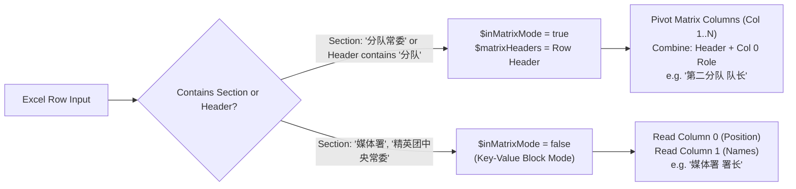

# Excel Parsing & State Machine Engine (PhpSpreadsheet)

This documentation explains how the system parses human-formatted Excel spreadsheets (like `精英团架构.xlsx`) into draft appointment records using **PhpSpreadsheet** and a **Block-Scanning State Machine**.

---

## 1. How the Parser Knows When to Switch Modes

The parser iterates over the spreadsheet row by row in a single pass. It switches between two distinct modes: **Key-Value Block Mode** and **Matrix Block Mode**.



### Triggers & State Variables

The state machine relies on 3 main state variables:
1. `$inMatrixMode` (`boolean`): Flags whether the current row belongs to a matrix table (`分队常委`).
2. `$matrixHeaders` (`array`): Stores the column headers for the matrix table (e.g. `[0 => '工委团', 1 => '第一分队', 2 => '第二分队', ...]`).
3. `$currentSubDepartment` (`string`): Stores the active sub-department prefix (e.g. `媒体署`, `研发署`).

### Trigger Logic Code Breakdown

In [`JytManagementController.php`](file:///c:/Users/User/Desktop/My%20Coding%20Projects/pgy_project/app/Http/Controllers/MA/JytManagementController.php#L975-L1007):

#### Step 1: Detect Section Header (`分队常委`)
When a row contains the section title `分队常委`, `$inMatrixMode` turns `true`:
```php
foreach ($sectionKeywords as $secKey) {
    if (mb_strpos($firstCell, $secKey) !== false) {
        $currentSection = $secKey;
        $currentSubDepartment = '';
        $inMatrixMode = ($secKey === '分队常委'); // <--- Enables Matrix Mode
        continue 2;
    }
}
```

#### Step 2: Capture Matrix Table Headers
When encountering the header row containing `分队` (e.g. `工委团 | 第一分队 | 第二分队 | 第三分队 | 第四分队 | 第五分队`), the array is saved as `$matrixHeaders`:
```php
$containsTeam = false;
foreach ($cleanRow as $cellVal) {
    if (mb_strpos($cellVal, '分队') !== false) {
        $containsTeam = true;
        break;
    }
}

if ($containsTeam) {
    $matrixHeaders = $cleanRow; // Stores ['工委团', '第一分队', '第二分队', ...]
    $inMatrixMode = true;
    continue;
}
```

#### Step 3: Pivoting Roles & Column-Based Extraction
When `$inMatrixMode` is `true` and `$matrixHeaders` is populated:
- **Column 0 (`$cleanRow[0]`)** holds the **Role / Position** for that row (e.g., `召集人`, `队长`, `副队长`).
  - If Column 0 is empty (e.g. additional rows under `副队长`), it falls back to **`委员`**.
- **Columns 1 to N (`$colIdx = 1..N`)** correspond to each team column in `$matrixHeaders`.

```php
if ($inMatrixMode && !empty($matrixHeaders)) {
    // Column 0 = Role name (fallback to '委员' if empty)
    $roleName = !empty($cleanRow[0]) ? $cleanRow[0] : '委员';
    if ($roleName === '工委团' || mb_strpos($roleName, '分队') !== false) continue;

    // Loop through every team column defined in $matrixHeaders
    for ($colIdx = 1; $colIdx < count($matrixHeaders); $colIdx++) {
        $teamHeader = $matrixHeaders[$colIdx] ?? ''; // e.g. '第二分队'
        $cellContent = $cleanRow[$colIdx] ?? '';     // e.g. '颜立扬'
        if (empty($teamHeader) || empty($cellContent)) continue;

        // Construct full position title: "第二分队 队长"
        $constructedPos = "{$teamHeader} {$roleName}";
        
        // Tokenize space-separated names
        $names = preg_split('/[\s,\/\n\r\t　]+/u', $cellContent, -1, PREG_SPLIT_NO_EMPTY);
        foreach ($names as $nameVal) {
            $candidates[] = [
                'raw_name' => $nameVal,
                'raw_position' => $constructedPos,
            ];
        }
    }
}
```

---

## 2. Key-Value Block Mode vs Matrix Block Mode Comparison

| Feature | Key-Value Mode (e.g. `媒体署`) | Matrix Mode (e.g. `分队常委`) |
| :--- | :--- | :--- |
| **Trigger** | Section header like `媒体署`, `中央各署` | Section header `分队常委` or header row with `分队` |
| **Position Source** | Column 0 cell text (`署长`, `委员`) | Combined: Column header (`第二分队`) + Column 0 role (`队长`) |
| **Names Source** | Column 1 cell text | Column 1 through N cell text |
| **Position Fallback** | `[SubDepartment] [Role]` | `[Team Header] 委员` |

---

## 3. Best Practices & Common Gotchas with PhpSpreadsheet

1. **Do Not Trim Trailing Cells via `array_pop` in Matrix Scanning**:
   - Standard `array_pop($row)` strips trailing empty string cells. If a row only has a name in Column 1 (`第一分队`), `count($row)` drops from 6 to 2.
   - Always iterate against `count($matrixHeaders)` or preserve original column indexes using `array_map` with `empty(array_filter($cleanRow))` checks.
2. **Space & Unicode Tokenization**:
   - Always use full regex matching for whitespace including full-width Chinese spaces (`　`): `preg_split('/[\s,\/\n\r\t　]+/u', $cellValue)`.
3. **Database Auto-Matching**:
   - Match extracted names against `username`, `name_en`, and `ic_num` first before resorting to partial/fuzzy matching.
