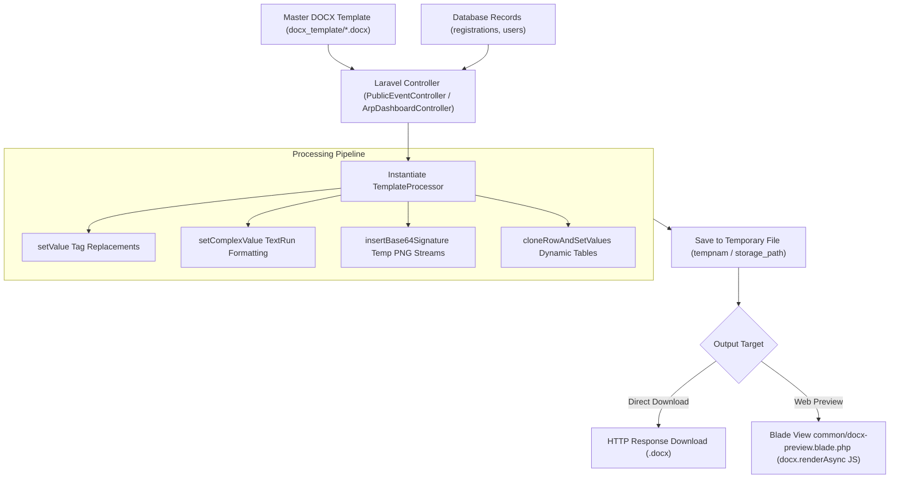

# PHPWord Document Templates Overview

The application utilizes **PHPWord `TemplateProcessor`** (`phpoffice/phpword`) to load pre-formatted Microsoft Word (`.docx`) templates from the `docx_template/` directory, substitute `${placeholder}` variable tags, inject dynamic table rows, decode base64 digital signatures into binary stream images, and output final `.docx` or web-rendered documents.

---

## 1. End-to-End Technical Architecture

The following diagram illustrates how PHPWord templates are loaded, processed by Laravel controllers, and delivered to end-users via docx downloads or browser previews:



---

## 2. Core Module Integrations & System Mapping

PHPWord template generation is integrated into three major backend modules:

| Module | Template File | Backend Controller & Methods | Primary Database Models | Output & Delivery |
| :--- | :--- | :--- | :--- | :--- |
| **Public Event Registration** | `docx_template/Parent Acknowledgement Letter.docx` | `PublicEventController::previewAcknowledgeLetter`<br/>`PublicEventController::downloadAcknowledgeLetter` | `Registration`, `Event` | Signed Parent Acknowledgment Letter (`.docx` download or web preview) |
| **JYT Appointment System** | `docx_template/JYT Appointment Letter.docx` | `JytManagementController::previewLetterPdf`<br/>`JytManagementController::downloadLetter` | `JytCadre`, `User` | Official Cadre Appointment Certificate with signature & seal |
| **ARP (Anugerah Remaja Perdana)** | `docx_template/ARP Logbook Template.docx` | `ArpDashboardController::downloadExport`<br/>`ArpDashboardController::exportLogbook` | `ArpRecord`, `ArpLog` | Complete participant activity logbook, photo evidence & report export |

---

## 3. Web Preview & Download User Interface

Users can preview processed `.docx` templates directly within the browser using the integrated client-side JS renderer before requesting a final download.


### Key Preview Flow
1. **Controller Action**: `previewAcknowledgeLetter($registrationId)` returns the `common.docx-preview` Blade view.
2. **AJAX Binary Stream**: The view fetches the docx endpoint (`downloadAcknowledgeLetter`) as an `ArrayBuffer`.
3. **JS Rendering**: Rendered in DOM via `docx-preview` library (`docx.renderAsync()`).


---

## 4. Technical Implementation Pattern

Below is a standard production pattern used in `PublicEventController.php` for populating placeholders, injecting base64 signatures, and returning a downloadable document:

```php
use PhpOffice\PhpWord\TemplateProcessor;
use PhpOffice\PhpWord\Element\TextRun;

public function downloadAcknowledgeLetter($registrationId)
{
    $registration = Registration::with('event')->findOrFail($registrationId);
    $templatePath = base_path('docx_template/Parent Acknowledgement Letter.docx');

    $templateProcessor = new TemplateProcessor($templatePath);
    $tempFiles = [];

    // 1. Basic Text Replacement
    $templateProcessor->setValue('parent_name_cn', htmlspecialchars($registration->parent_name ?? ''));
    $templateProcessor->setValue('participant_name_cn', htmlspecialchars($registration->chinese_name ?? ''));
    $templateProcessor->setValue('reg_date', $registration->created_at->format('d/m/Y'));

    // 2. Complex TextRun Injection (Styled Text)
    $genderRun = new TextRun();
    $fontCn = ['name' => 'KaiTi', 'size' => 11];
    if ($registration->gender === 'Male') {
        $genderRun->addText('儿子', array_merge($fontCn, ['bold' => true, 'underline' => 'single']));
        $genderRun->addText(' / 女儿', $fontCn);
    } else {
        $genderRun->addText('儿子 / ', $fontCn);
        $genderRun->addText('女儿', array_merge($fontCn, ['bold' => true, 'underline' => 'single']));
    }
    $templateProcessor->setComplexValue('gender_cn', $genderRun);

    // 3. Base64 Signature Image Stream Injection
    if ($registration->parent_signature) {
        $this->insertBase64Signature($templateProcessor, 'parent_sig', $registration->parent_signature, $tempFiles);
    } else {
        $templateProcessor->setValue('parent_sig', '');
    }

    // 4. Save & Clean Temporary Files
    $tempDocx = tempnam(sys_get_temp_dir(), 'docx_');
    $templateProcessor->saveAs($tempDocx);

    foreach ($tempFiles as $file) {
        if (file_exists($file)) @unlink($file);
    }

    return response()->download($tempDocx, 'Acknowledgement_Letter.docx')->deleteFileAfterSend(true);
}
```

---

## 5. Related Documentation & Detailed Guides

To explore specific PHPWord processing techniques and template management features, consult the following guides:

- **[Word (.docx) Variable Placeholders](./02-docx-variable-placeholders.md)** — Detailed rules for tag syntax `${var}`, dynamic row cloning (`cloneRowAndSetValues`), and XML fragmenting pitfalls.
- **[Image & Signature Injection](./03-image-and-signature-injection.md)** — How to handle base64 image data URLs, temporary PNG conversion, and `setImageValue` dimension scaling.
- **[Docx Preview Component](../document-rendering/01-renderer-vs-docx-preview.md)** — Frontend JS integration (`docx.renderAsync()`) and preview modal architecture.
- **[Template Designer Overview](../template-designer/01-overview.md)** — Visual template creation and custom schema specifications.

