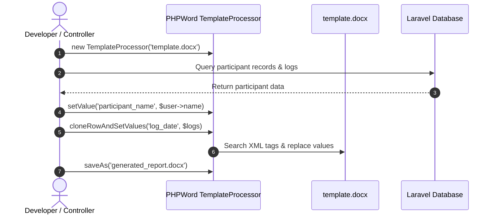

# Word (.docx) Variable Placeholders

This guide explains how to define variable placeholders inside Microsoft Word documents and process them via `PhpOffice\PhpWord\TemplateProcessor`.

## Processing Flow



---

## 1. Defining Placeholders in Microsoft Word

Inside Microsoft Word, write variable names wrapped in `${}` syntax:


```text
姓名 (Name): ${participant_name}
身份证号码 (IC): ${ic_number}
所属机构 (Organization): ${organization_name}
```

:::warning[Word XML Fragmenting Pitfall]

Sometimes Microsoft Word splits `${participant_name}` into multiple internal XML runs `<w:t>${participant_</w:t><w:t>name}</w:t>`. 
If `TemplateProcessor` fails to replace a variable:
1. Re-type the variable in a plain text editor (e.g. Notepad) and paste it back into Word.
2. Or use Word's *Clear Formatting* button on the variable.

:::

---

## 2. Replacing Single Variables in Controller

To replace single string placeholders in the template:

```php
use PhpOffice\PhpWord\TemplateProcessor;

$templateProcessor = new TemplateProcessor(storage_path('app/templates/arp_logbook.docx'));

$templateProcessor->setValue('participant_name', htmlspecialchars($user->username ?? ''));
$templateProcessor->setValue('ic_number', htmlspecialchars($user->ic_num ?? ''));
$templateProcessor->setValue('organization_name', '蒲公英文教工作坊');
```

---

## 3. Dynamic Table Row Cloning (`cloneRowAndSetValues`)

For dynamic lists like activity log entries or table rows:


```php
$logs = [
    ['log_date' => '2026-08-01', 'log_activity' => '社区服务 (Community Service)', 'log_hours' => '4'],
    ['log_date' => '2026-08-10', 'log_activity' => '体能训练 (Physical Training)', 'log_hours' => '2'],
];

// Automatically clones table row containing ${log_date}
$templateProcessor->cloneRowAndSetValues('log_date', $logs);
```

---

## 4. Related Guides & References

- **[PHPWord Document Templates Overview](./01-overview.md)** — Core architecture, module mapping table, and controller integration.
- **[Image & Signature Injection](./03-image-and-signature-injection.md)** — Decoding base64 digital signatures into binary stream images.

