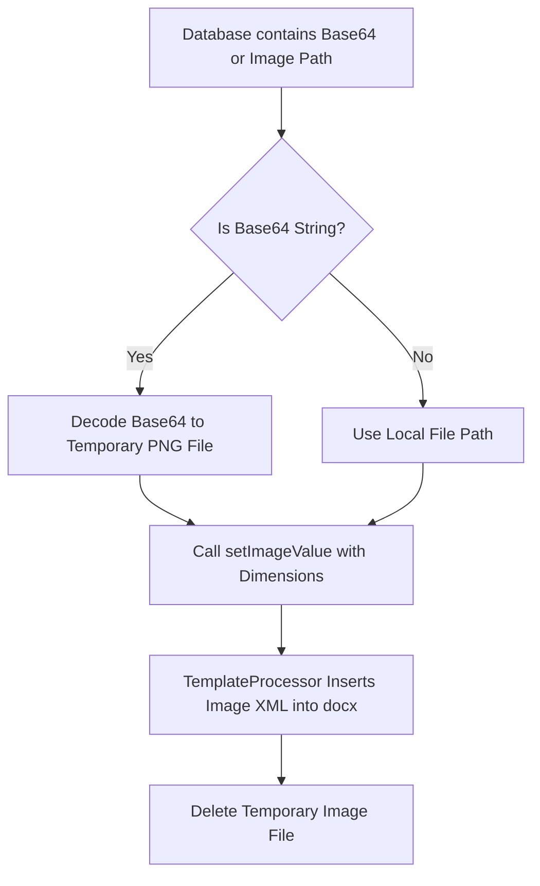

# Image & Signature Injection in PHPWord

This guide covers injecting digital signatures and photo uploads into `.docx` template placeholders.

## Image Injection Flow



## 1. Injecting Base64 Signature Images

Because `TemplateProcessor::setImageValue()` requires a physical image file path on disk, Base64 strings must be decoded to a temporary file before insertion:

```php
$base64Sig = $appointment->member_signature; // "data:image/png;base64,..."

if (!empty($base64Sig) && str_starts_with($base64Sig, 'data:image/')) {
    // Decode base64 bytes
    $imageParts = explode(';base64,', $base64Sig);
    $imageBase64 = base64_decode($imageParts[1]);

    // Save temporary file
    $tempImagePath = storage_path('app/temp/sig_' . uniqid() . '.png');
    file_put_contents($tempImagePath, $imageBase64);

    // Inject into ${member_signature} placeholder
    $templateProcessor->setImageValue('member_signature', [
        'path'   => $tempImagePath,
        'width'  => 180,
        'height' => 60,
        'ratio'  => true,
    ]);

    // Save output document
    $outputPath = storage_path('app/exports/generated_report.docx');
    $templateProcessor->saveAs($outputPath);

    // Cleanup temporary image
    @unlink($tempImagePath);
}
```

## 2. Image Placeholder Parameters

| Option | Type | Description |
| :--- | :--- | :--- |
| `path` | `string` | Absolute server path to the image file on disk. |
| `width` | `int` | Width in pixels (`px`) or points. |
| `height` | `int` | Height in pixels (`px`) or points. |
| `ratio` | `bool` | Keep aspect ratio when scaling. |
