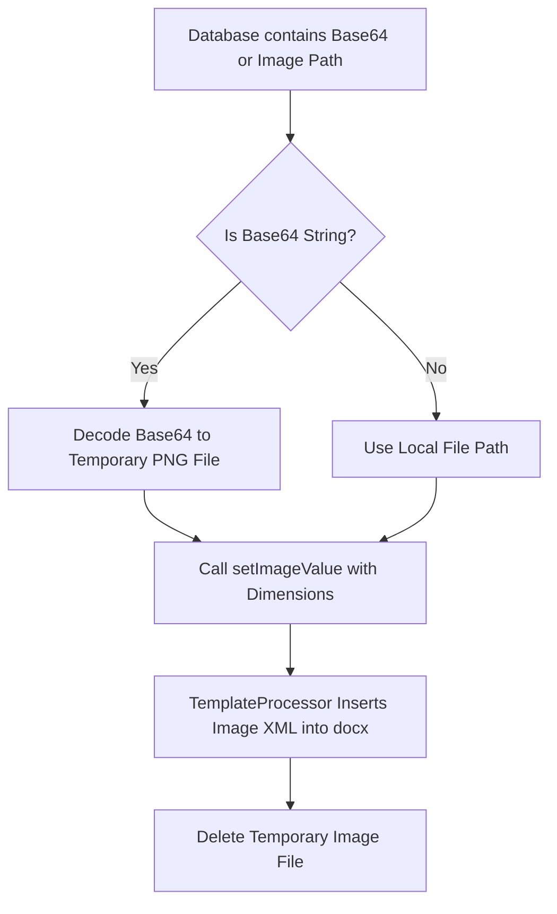

# Image & Signature Injection in PHPWord

This guide covers injecting digital signatures and photo uploads into `.docx` template placeholders via `PhpOffice\PhpWord\TemplateProcessor`.

---

## Image Injection Flow



---

## 1. Injecting Base64 Signature Images

Digital signature pads on web forms store signatures as Base64 Data URLs (e.g. `data:image/png;base64,...`).


Because `TemplateProcessor::setImageValue()` requires a physical image file path on disk, Base64 strings must be decoded to a temporary file before insertion:

```php
$base64Sig = $registration->parent_signature; // "data:image/png;base64,..."

if (!empty($base64Sig) && str_contains($base64Sig, 'base64,')) {
    // Decode base64 bytes
    $base64Clean = substr($base64Sig, strpos($base64Sig, ',') + 1);
    $imageData = base64_decode($base64Clean);

    // Save temporary file
    $tempImagePath = tempnam(sys_get_temp_dir(), 'sig_') . '.png';
    file_put_contents($tempImagePath, $imageData);

    // Inject into ${parent_sig} placeholder
    $templateProcessor->setImageValue('parent_sig', [
        'path'   => $tempImagePath,
        'width'  => 120,
        'height' => 32,
        'ratio'  => true,
    ]);

    // Save output document
    $outputPath = storage_path('app/exports/generated_letter.docx');
    $templateProcessor->saveAs($outputPath);

    // Cleanup temporary image
    if (file_exists($tempImagePath)) {
        @unlink($tempImagePath);
    }
}
```


---

## 2. Image Placeholder Parameters

| Option | Type | Description |
| :--- | :--- | :--- |
| `path` | `string` | Absolute server path to the image file on disk (e.g., `storage_path(...)` or `/tmp/...`). |
| `width` | `int` | Target width in pixels (`px`) or points. |
| `height` | `int` | Target height in pixels (`px`) or points. |
| `ratio` | `bool` | Set `true` to maintain aspect ratio during scaling. |

---

## 3. Related Documentation & Guides

- **[PHPWord Document Templates Overview](./01-overview.md)** — Overall system architecture and controller integration.
- **[Word (.docx) Variable Placeholders](./02-docx-variable-placeholders.md)** — Replacing text tags and dynamic table rows.

