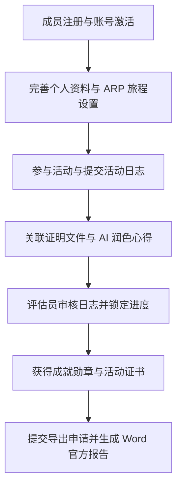

# 系统介绍与指南总览

欢迎使用**综合青年奖项与活动管理系统**官方文档门户！

本系统旨在为青年成员、评估员领袖及系统管理员提供全方位的活动管理、ARP 青年奖项进度追踪、成就勋章授予以及自动化官方报告生成服务。

---

## 1. 核心功能模块概览

系统由以下核心业务模块组成，各模块相互协作，构成了完整的青年成长与活动管理体系：

| 模块名称 | 适用角色 | 核心功能与说明 |
| :--- | :--- | :--- |
| **ARP 青年奖项模块** | 选手 / 评估员 / 管理员 | 选手项目旅程设置、活动日志提交、证明文件关联、AI 心得润色、评估员审核以及官方 Word 报告自动化编译导出。 |
| **活动管理模块** | 全体用户 / 活动管理员 | 浏览公开活动、在线报名、活动签到、岗位审核分工、活动通知与电子证书发放。 |
| **会员与勋章系统** | 全体成员 | 个人成就仪表板、勋章积累与展示、荣誉记录查看与评价。 |
| **账户与安全管理** | 全体用户 | 账号注册激活、Google 快捷登录、密码重置、个人资料修改与安全保护。 |
| **系统后台管理** | 系统管理员 | 选手资格开通与名册管理、导出审核与领袖电子签署、场地与模板自定义设置。 |
| **社区圈子** | 全体成员 | 动态发布、活动社区互动、个人风采展示。 |

---

## 2. 整体运行流程

系统从用户注册、活动参与、日志记录直到最终获得认证与报告导出的全过程如下：

---

## 3. 用户角色与权限说明

系统根据用户的角色分配不同的操作权限，确保各项审批与管理的规范性：

- **普通成员 / ARP 选手**：
  - 浏览并报名参加公开活动。
  - 配置个人的 ARP 旅程目标（铜奖、银奖、金奖）。
  - 提交活动日志、上传证明文件、预览个人 Word 报告。
- **评估员 / 领袖 (Assessor / Leader)**：
  - 审阅选手提交的活动日志，填写改进评语或通过审核。
  - 为选手的导出报告撰写阶段领袖评语并签署电子签名。
- **系统管理员 (Admin / Co-Admin)**：
  - 管理全机构成员账号与 ARP 选手资格开通。
  - 审阅最终导出申请并生成正式官方报告。
  - 发布活动、配置系统模板及自定义参数。

---

## 4. 文档导航

您可以通过左侧导航栏快速查阅各模块的具体使用指南：

- **[ARP 青年奖项指南](./arp/journey-setup.md)** — 包含旅程设置、日志提交、历史状态、报告导出及常见问题说明。
- **[PHPWord 模板指南](./dev-notes/working-with-phpword/01-overview.md)** — Word 模板生成与 dynamic row/image 替换技术。
- **[Template Designer 指南](./dev-notes/template-designer/01-overview.md)** — 拖拽式 HTML 证书设计器与脚本语法。

