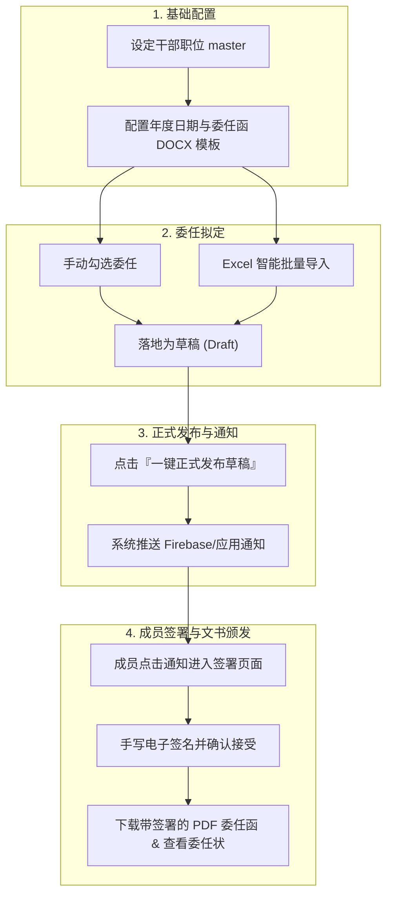

# 精英团系统概述

欢迎使用蒲公英精英团干部委任管理系统！本模块专为系统管理员与秘事务组设计，旨在简化年度精英团干部的头衔委任、委任函生成、在线签署及委任状颁发全流程。

:::info[系统核心特点]

* **全流程数字化**：从草稿拟定、批量导入、正式发布到成员手写电子签署，全程在线高效追踪。
* **双文书自动生成**：自动生成官方 Word/PDF 委任函（DOCX）以及可视化数字委任状（Certificate）。
* **智能 Excel 解析**：无需手动一行行录入，直接拖拽或粘贴秘事务组惯用的 Excel 表格即可智能匹配与导入。

:::

---

## 委任管理核心业务流程

---

## 核心概念说明

| 概念 | 说明 |
| :--- | :--- |
| **委任草稿 (Draft)** | 秘事务组拟定中的干部头衔，带有 `📝 (草稿)` 标志。**完全不发送任何通知**，可反复修改。 |
| **正式委任 (Pending)** | 已发送给成员的委任状态，成员会收到通知提示进行手写签署。 |
| **接受委任 (Accepted)** | 成员已完成手写电子签名并确认接受委任，可正式下载 PDF 委任函与查看委任状。 |
| **不接受 (Declined)** | 成员主动拒绝委任，或管理员因逾期一键标记为不接受。 |
| **年度委任函** | 包含正式公文排版、条款与签名栏的 Word 文档，支持导出 PDF。 |
| **年度委任状** | 在线展现的可视化烫金/设计感委任证书，供成员保存与展示。 |

---

## 快速导航

* [干部职位与年度配置指南](./02-year-config-and-positions.md)
* [干部委任与草稿发布指南](./03-assignment-and-drafts.md)
* [Excel 智能批量导入指南](./04-excel-import.md)
* [干部签署与委任状查看指南](./05-member-acceptance-and-certificate.md)
