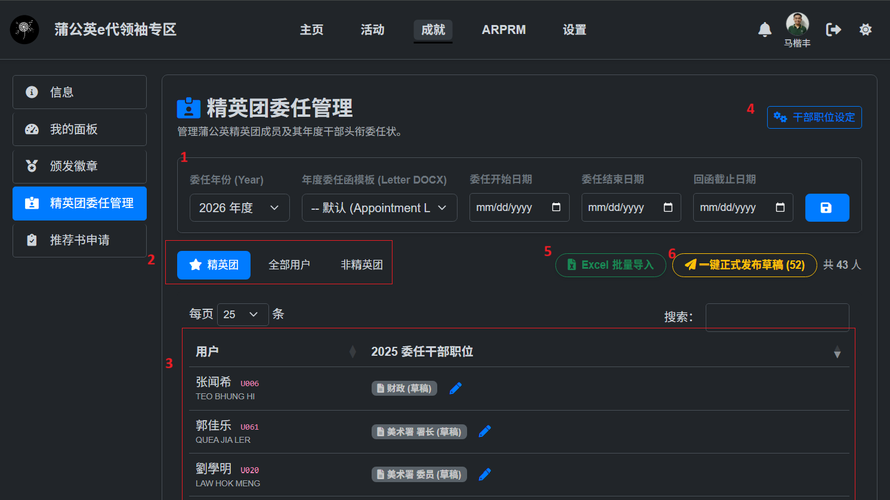
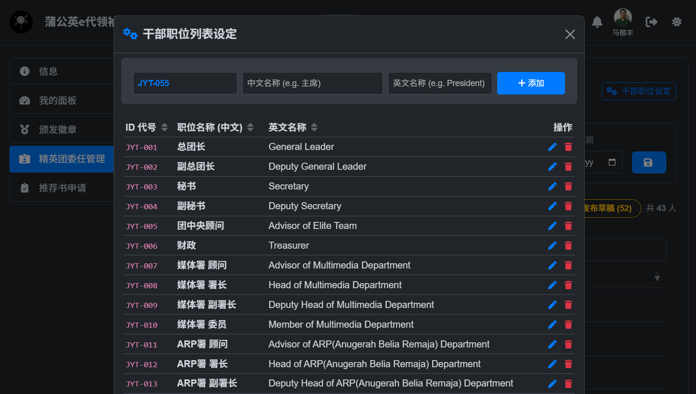

# 干部职位与年度配置指南

在开展任何年度的干部委任工作前，管理员需要先完成**干部职位设定**与**年度委任参数配置**。

图1 干部职位与年度配置界面

功能描述：
1. **年度委任参数配置**：用于配置当前年度的时间范围、回函截止日期以及所使用的官方委任函 Word 模板。
2. **成员分类筛选**：快捷筛选『精英团』、『全部用户』以及『非精英团』三大类人员列表。
3. **成员委任表格与编辑**：实时展示所有成员及其对应的干部委任头衔，并支持进行专属编辑与委任调整。
4. **职位管理**：用于管理所有干部职位头衔的增删改查。

---

## 1. 配置年度委任参数 (Year Configuration)

每年委任开启前，管理员需配置该年度的时间范围、回函截止日期以及所使用的官方委任函 Word 模板。

### 配置项详细说明

| 配置字段 | 说明 |
| :--- | :--- |
| **委任年份 (Year)** | 选择或切换当前管理的年度（如 `2026 年度`）。 |
| **年度委任函模板 (Letter DOCX)** | 从下拉菜单中选择套用的 Word 委任函模板文件（如 `Appointment Letter.docx`）。 |
| **委任开始日期** | 当前年度干部的履职起始日期（如 `2026-01-01`）。 |
| **委任结束日期** | 当前年度干部的履职届满日期（如 `2026-12-31`）。 |
| **回函截止日期** | 成员需在该日期前完成手写签署并提交确认。 |

:::info[委任函模板自动匹配]
- 系统会自动扫描 `docx_template` 目录下包含 `appointment` 字样的 Word 模板文件供您选择。
- 如果您没有专门指定，系统将默认采用 `Appointment Letter.docx` 模板。
- 如需使用全新模板，请通知技术人员更新服务器`docx_template` 里的文档。
:::

---
## 2. 干部职位设定 

系统支持自定义精英团的所有干部职位头衔（如 `团中央顾问`、`媒体署 署长`、`第一分队 队长` 等）。

### 添加与管理职位步骤

1. 进入管理后台菜单 **精英团委任管理**。
2. 点击顶部右上角的 **`⚙️ 干部职位设定`** 按钮，打开职位管理弹窗。

图2 添加与管理职位

3. 在弹窗顶部的表单中填写：
   * **职位编号 (ID)**：系统会自动生成下一个可用编号（如 `JYT-001`、`JYT-002`）。
   * **职位名称 (中文)**：如 `研发署 署长`。
   * **英文名称**：如 `Head of R&D Department`。
   * *注：中英名字都会在最终的委任状展示出来*
4. 点击 **`添加职位`** 完成保存。
5. 现有职位可在列表中点击 **修改** 或 **删除** 图标进行调整。

:::info[提示]
在使用 [Excel 批量导入](04-excel-import.md) 功能时，如果表格中包含了系统中尚不存在的新职位，系统会自动为您创建该职位，无需手动预先逐个录入！
:::