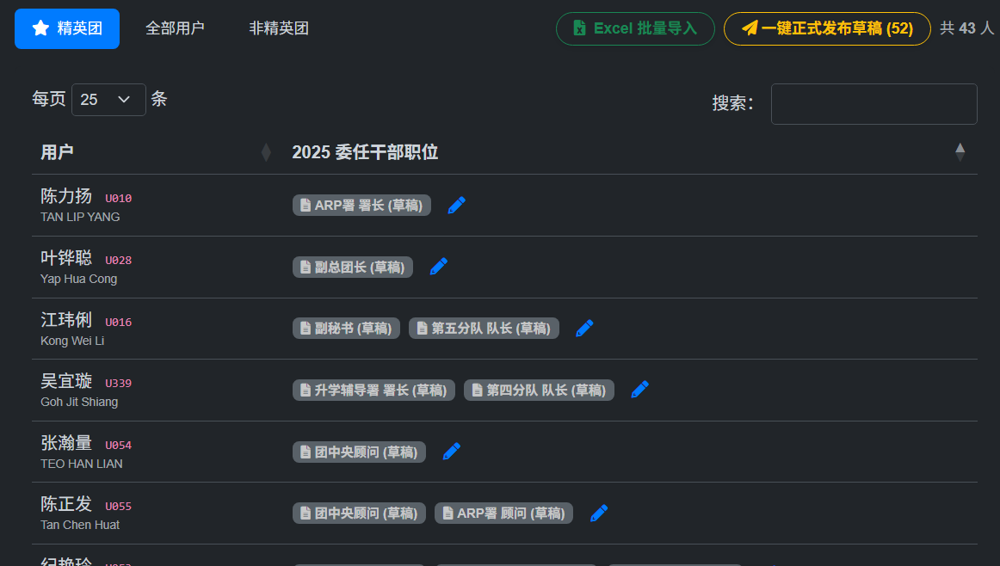
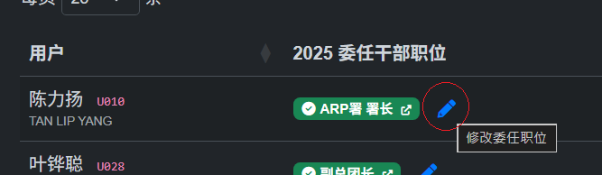
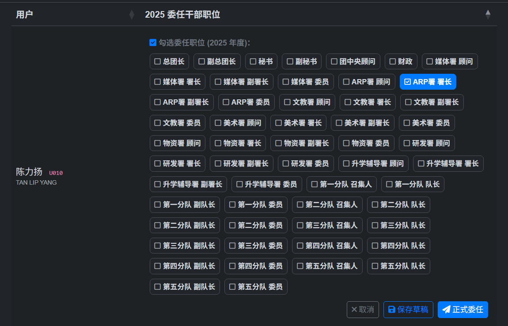
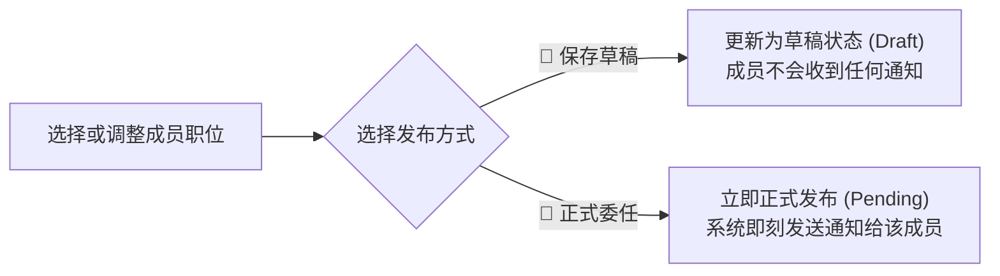

# 干部委任与草稿发布指南

在精英团委任管理界面中，管理员与秘事务组可以为每位成员指派一个或多个干部头衔。系统提供了**保存草稿**与**正式委任**两种发布机制。

图1 干部列表界面

## 1. 成员委任配置步骤

1. 在管理表格中找到目标成员所在的行。
2. 点击✏铅笔按钮召唤勾选框

图2 修改委任信息

3. 挑选该成员在该年度承担的干部职位（支持多选）。

图3 选择委任职位

4. 针对该成员的操作按钮：

---

## 2. 『保存草稿』与『正式委任』的区别

| 功能 | 应用通知 | 适用场景 |
| :--- | :--- | :--- |
| `💾 保存草稿` | ❌ **不推送** | 秘事务组拟定阶段、反复校对调整中 |
| `🚀 正式委任` | 🔔 **即刻推送通知** | 确认无误，需要指定成员立即在线签署 |

---

## 3. 一键批量正式发布草稿

当秘事务组完成了整份名单的草稿拟定与核对后，无需逐个点击正式委任。

1. 观察表格顶部的操作栏，当存在未发布的草稿时，会出现黄色高亮的 **`🚀 一键正式发布草稿 (X条)`** 按钮（见图1右上角）。
2. 点击按钮后，系统会弹出二次确认框。
3. 确认后，系统会将该年度所有状态为草稿的委任记录**一次性正式发布**，并自动向所有相关干部推送委任通知。

---

## 4. 撤销/取消已接受委任的风险警示

:::warning[警示：撤销已接受委任的提示]

如果您取消勾选了一个**已被其他用户签署并接受 (`accepted`)** 的职位，在点击保存时，系统会弹出专门的风险警示对话框警示提醒，明确列出被取消的已被接受头衔。

:::
