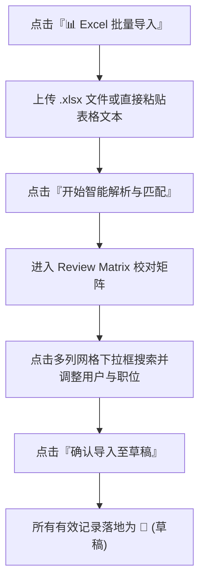

# Excel 智能批量导入指南

为减轻秘事务组手动逐个勾选委任的工作量，系统内置了**Excel 智能解析与数据匹配引擎**。秘事务组可直接上传惯用的 Excel 表格或复制表格内容，由系统自动提取干部姓名、职位并匹配系统用户。

---

## 1. 智能解析引擎支持的格式规则

系统支持解析各种非标准化的人力资源表格：

1. **多姓名空格分隔**：单元格内包含多个人名（如 `纪艳玲 张瀚量 许升耀`），系统会自动拆分为独立候选人。
2. **部门前缀自动拼接**：部门表格块（如 `媒体署` 下方的 `委员`），系统会自动拼接为 `媒体署 委员`。
3. **分队矩阵表格**：横向表头为分队（如 `第一分队 | 第二分队`），纵向为职务（如 `队长 | 副队长`），系统会自动转置为 `第一分队 队长`。

---

## 2. 批量导入操作步骤

### 操作流程

1. 点击数据表格上方的 **`📊 Excel 批量导入`** 按钮。
2. 选择导入方式：
   * **上传 Excel 文件**：拖拽或选择 `.xlsx` / `.csv` 文件。
   * **粘贴表格文本**：在 Excel 中复制表格区域，直接粘贴到文本框中。
3. 点击 **`开始智能解析与匹配`**。
4. 系统处理完成后，自动进入 **Review Matrix (校对矩阵)** 界面。

---

## 3. 校对矩阵与 ERP 多列网格搜索下拉框说明

校对矩阵集成了 DataTables 高效搜索、分页以及 **AutoCount ERP 风格的多列网格下拉框**。

:::info[活跃用户过滤与多列搜索]

* **仅列出活跃系统用户**：下拉框网格中仅包含在系统中处于 **活跃状态 (`is_active = true`)** 的干部成员，自动排除已离职或停用的账号。
* **多列搜索与匹配**：在下拉框顶部的搜索框中输入 **User ID (如 `U001`)**、**中文姓名** 或 **英文姓名**，即可实时过滤候选人员。
* **状态持久化**：跨页翻页（如从第 1 页切换至第 2 页）时，您在第 1 页做出的选择将全程自动保留，不会丢失任何更改。您也可以在每页显示下拉菜单中选择 **`全部 (Show All)`** 实现单页无缝滚动查看。

:::

### UI 元素与颜色高亮说明

| UI 元素 / 颜色样式 | 状态标识 | 含义与操作建议 |
| :--- | :--- | :--- |
| 🟢 **绿色标签** | `完全匹配` | 姓名与职位在系统数据库中均 100% 找到匹配项。 |
| 🟡 **黄色高亮输入框** | `用户待选择` | **未在系统中精确匹配到活跃用户**（如 Excel 错别字或别名）。点击输入框打开多列网格搜索下拉框，输入姓名或 ID 选定正确用户。下拉框顶部提供 **`[ ✕ 清除 ]`** 按钮。 |
| 🔵 **蓝色高亮输入框** | `新职位` | 用户匹配成功，但该职位名称在系统中尚不存在。系统下拉框顶部提供 **`[ ＋ 新职位 ]`** 按钮，确认后将在导入时自动新建该职位。 |
| ⚪ **灰色标签** | `未匹配` | 姓名与职位均未匹配到记录。 |

---

## 4. 跳过未匹配记录与 SweetAlert 确认弹窗

在点击 **`确认导入至草稿 (Import to Drafts)`** 时：

1. **自动跳过逻辑**：任何**未选择系统用户**的候选记录均会被系统自动跳过，不会产生垃圾数据。
2. **SweetAlert 详细警示**：如果有被跳过的记录，SweetAlert 对话框会以红色警告框形式，**逐条列出将被跳过的候选人姓名与对应职位**，供秘事务组二次核对。
3. **安全落地为草稿**：确认后，所有有效匹配记录将落地为 **草稿 (`status = 'draft'`)**。秘事务组可在主表格中再次核对无误后，一键正式发布！
