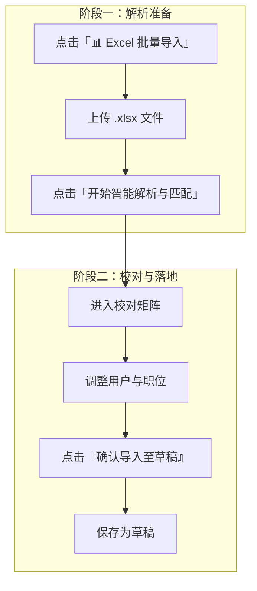
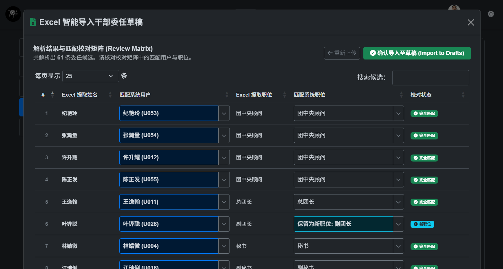
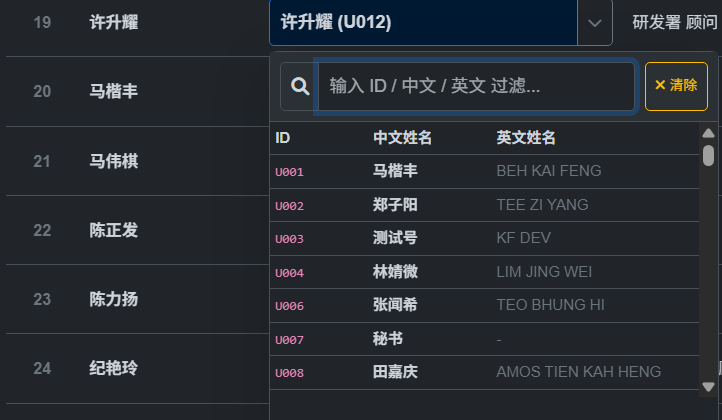

# Excel 智能批量导入指南

上一期，我们有说到要修改一个人的委任信息，可点击铅笔✏按钮来进行勾选操作。但是，如果我们有几十个人需要修改委任信息的话，就会比较麻烦了。

为减轻秘书手动逐个勾选委任的工作量，系统内置了**Excel 智能解析与数据匹配引擎**。秘书可直接上传 Excel 文件，请务必使用
[📊 精英团架构 Excel 导入模板](https://docs.google.com/spreadsheets/d/1Q60vpGHJOEUajcXDw5Teoqf85rnf4Pk4/edit?usp=drive_link&ouid=109347403517477508991&rtpof=true&sd=true)。

系统将进行智能解析与匹配，自动提取干部姓名、职位并匹配系统用户。

---

## 1. 智能解析引擎支持的格式规则

系统支持解析这几种格式：

1. **多姓名空格分隔**：单元格内包含多个人名（如 `纪艳玲 张瀚量 许升耀`），系统会自动拆分为独立的干部姓名。
2. **部门前缀自动拼接**：部门表格块（如 `媒体署` 下方的 `委员`），系统会自动拼接为 `媒体署 委员`。
3. **分队矩阵表格**：横向表头为分队（如 `第一分队 | 第二分队`），纵向为职务（如 `队长 | 副队长`），系统会自动转置为 `第一分队 队长`。

---

## 2. 批量导入操作步骤

### 操作流程

1. 点击数据表格上方的 **`📊 Excel 批量导入`** 按钮。

图1 Excel 智能批量导入

2. 上传 Excel 文件，**拖拽或选择 `.xlsx` / `.csv` 文件。**
3. 点击 **`开始智能解析与匹配`**。

图2 选择excel文件

4. 系统处理完成后，自动进入 **Review Matrix (校对矩阵)** 界面。
---

## 3. 校对矩阵说明

图3 校对矩阵

* **仅列出启用账号**：下拉框网格中仅包含在系统中处于 **启用状态** 的系统用户，自动排除已被停用的账号。
* **多列搜索与匹配**：在下拉框顶部的搜索框中输入 **User ID (如 `U001`)**、**中文姓名** 或 **英文姓名**，即可实时过滤候选人员。

图4 搜索用户

### 校对状态颜色说明
图1中可以看到，每一列的最右边有一栏"校对状态"。只有全部是绿色与绿色的标识，这一列才会完整地被导入到草稿中。

| 状态标识 | 含义与操作建议 |
| :--- | :--- |
| 🟢 `完全匹配` | 姓名与职位在系统数据库中均 100% 找到匹配项。 |
| 🔵 `新职位` | 用户匹配成功，但该职位名称在系统中尚不存在，但也有可能是该职位在Excel中用了不同的名字。 |
| 🟡 `用户待选择` | **未在系统中精确匹配到活跃用户**（如 Excel 错别字或别名）。点击输入框打开多列网格搜索下拉框，输入姓名或 ID 选定正确用户。 |
| ⚪ `未匹配` | 姓名与职位均未匹配到记录。 |

---

## 4. 关于新职位（蓝色标识）的疑惑

刚刚有说到蓝色标识可能代表着两种情况，分别是：
1. 系统已有的岗位但用了不同的名字（比如 `媒体署 顾问` vs `媒体署 内部顾问`）——这种情况下需要斟酌哪一个才是正确的。但一般会采用系统中的岗位，因此请确保使用正确的excel模板。

图5 重复的岗位

2. 确实是新的岗位。如果是这种情况，那么可以放心确认并保存，系统在导入数据时会自动新建该职位。

---

## 5. 确认导入至草稿
在点击 **`确认导入至草稿 (Import to Drafts)`** 时，系统会发出以下提醒：

图6 导入至草稿

1. **自动跳过逻辑**：任何**未选择系统用户**的委任记录（参考图5）均会被系统自动跳过。请务必让相关干部创建并激活账号，才可委任新岗位。至于外部顾问，可能就不需要让他们开账号。
2. 当然，建议秘书二次核对系统逐条列出将被跳过的干部姓名与对应职位，确保没有其他遗漏。
3. **安全落地为草稿**：确认后，所有有效匹配记录将落地为 **草稿** 而不是直接委任。秘书们可在主表格中再次核对无误后，一键正式发布！
