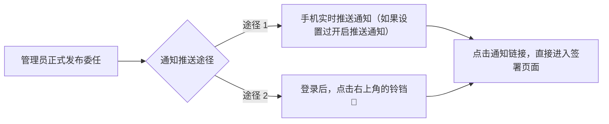
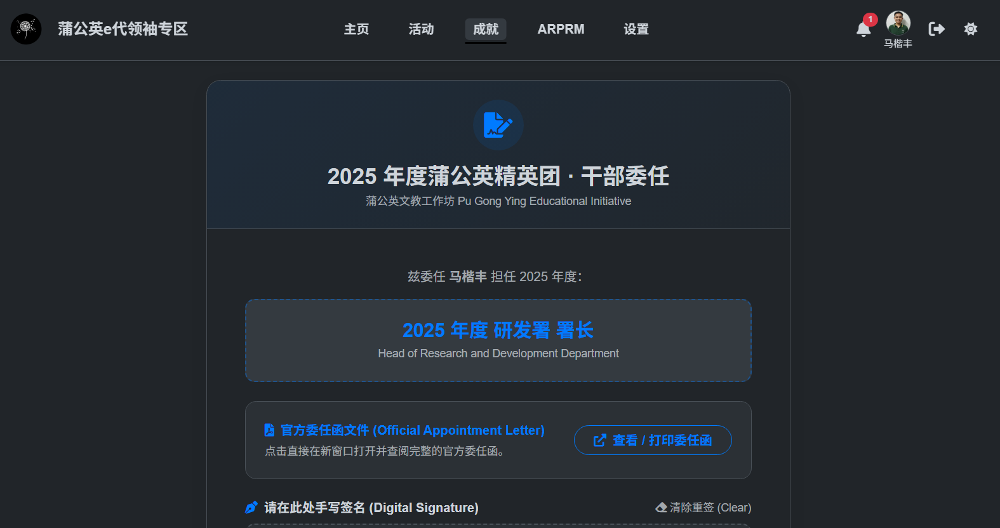
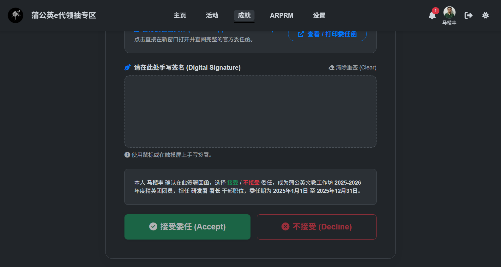
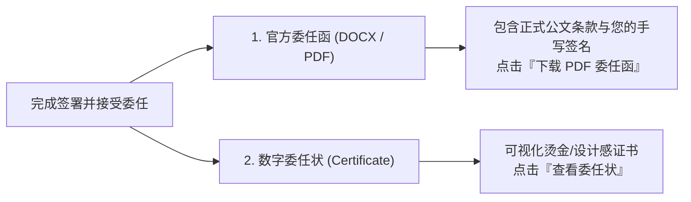
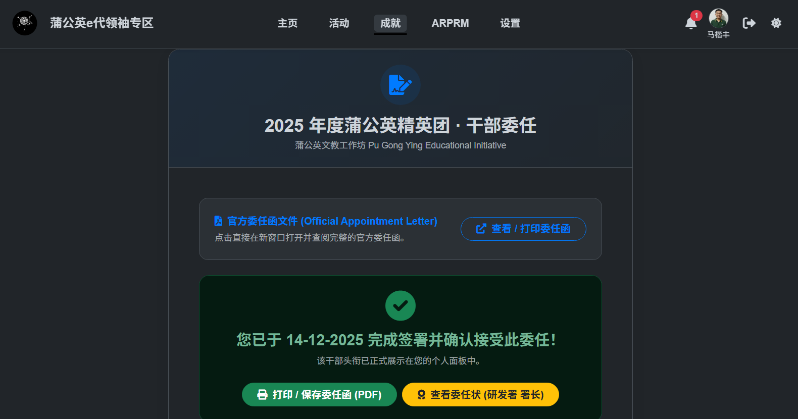
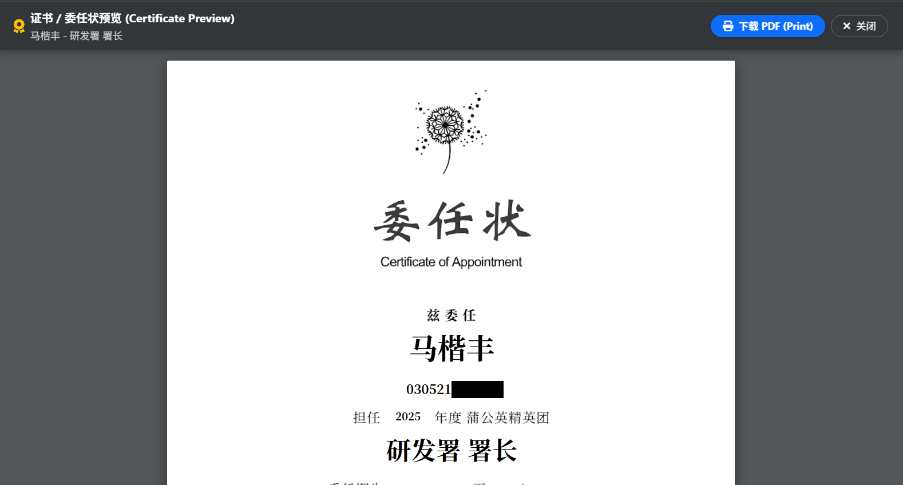

# 干部接受委任指南

本指南专为收到委任通知的蒲公英精英团干部编写，说明如何在线完成委任函签署、确认接受委任以及查看/下载委任文书。

---

## 1. 收到委任通知与进入签署页面

当秘事务组或管理员正式发布委任后，您会通过以下两种途径收到通知：

---

## 2. 在线完成手写电子签署

进入委任函签署页面后：

1. **阅读委任函公文**：页面将展示该年度为您颁发的官方委任函公文，包含您的头衔、任期起始与结束日期。在这里，你也可以点击【查看 / 打印委任函】来查阅委任函的PDF文件。

图1 委任函签署页面

2. **手写电子签名**：
   * 在页面底部的电子签名板上，使用鼠标或手机触摸屏绘制您的手写签名。
   * 如需重写，可点击 **`清除重签`**。

图2 手写电子签名

3. **选择回复状态**：
   * **确认接受委任**：勾选“我已仔细阅读并确认接受以上委任”，点击提交。
   * **不接受委任**：若因个人原因无法履职，选择不接受并填写说明。

---

## 3. 签署完成后的文书获取 (PDF 委任函 & 委任状)

完成签署并接受委任后，您可以随时获取两份官方文书：

### 1. 下载带签名的官方 PDF 委任函
在签署完成页面或个人仪表板中，点击 **`📄 下载 PDF 委任函`** 按钮。系统将自动生成附带您手写签名及官方印章的完整 PDF 文件供您保存存档。

图3 签署完成页面

### 2. 在线查看与保存数字委任状 (Certificate)
在签署完成页面点击 **`🏅 查看委任状`** 按钮：
* 系统将在线渲染设计精美的**数字委任证书**。
* 证书上实时呈现您的姓名、头衔、委任年份与委任期。

图4 委任证书

